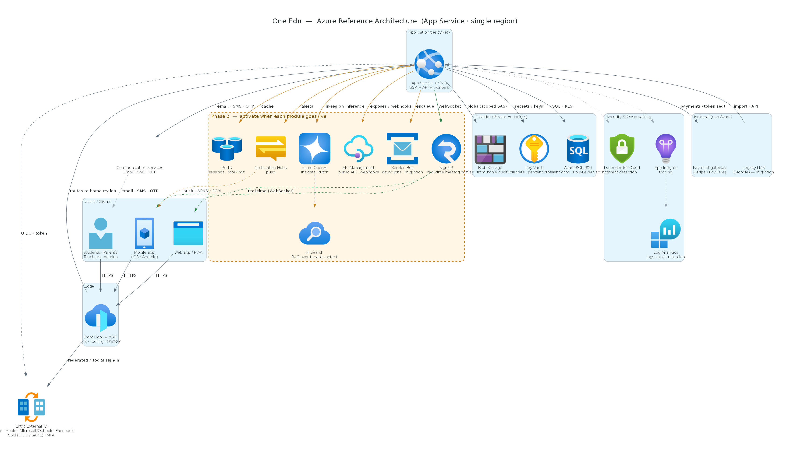
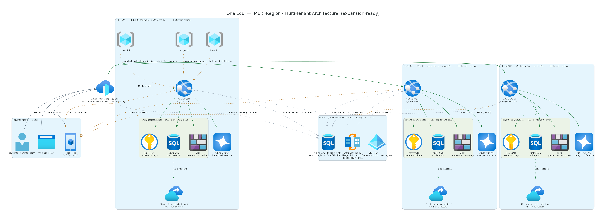

# One Edu — Hosting & Infrastructure Architecture

### Board Briefing · Cloud Hosting Design

---

| | |
|---|---|
| **Document** | Hosting & Infrastructure Architecture |
| **Product** | One Edu — Education Super App |
| **Prepared for** | Board of Directors |
| **Classification** | Internal / Confidential |
| **Version** | 1.1 |
| **Date** | June 2026 |
| **Cloud platform** | Microsoft Azure |
| **Primary region** | UK South (UK West for DR) |
| **Status** | For board review |

### Document Revision History

| Version | Date | Author | Summary of change |
|---|---|---|---|
| 0.9 | June 2026 | Architecture Team | Internal draft for review. |
| 1.0 | June 2026 | Architecture Team | Initial board release — single-region & multi-region designs, component briefs, security & governance briefing. |
| 1.1 | June 2026 | Architecture Team | Identity briefs + diagrams updated with social providers (Google, Apple, Microsoft/Outlook, Facebook). |

---

## 1. Executive Summary

One Edu will be hosted on **Microsoft Azure** as a secure, compliant, multi-tenant SaaS platform. The design is deliberately **phased** to control cost and risk:

- **Launch (Phase 1):** a single Azure region hosting the first institution, built on managed **Azure App Service** and **Azure SQL Database** — a lean, production-grade footprint with high availability.
- **Scale (future):** the *same* blueprint is replicated into additional geographic regions, giving each country its own data boundary. This proves the platform is **expansion-ready** without re-architecture.

Two architectures are presented separately in this document:

1. **Single-Region (Single-Tenant) Architecture** — the day-one production environment (Section 5).
2. **Multi-Region (Multi-Tenant) Architecture** — the target operating model as the platform grows internationally (Section 6).

The estimated monthly hosting + tooling cost (excluding staff) for the launch environment is summarised in Section 9 and detailed in the companion workbook *CostEstimate-OneEdu-Board.xlsx*.

---

## 2. Purpose & Scope

**Purpose.** To give the Board a clear, non-exhaustive view of how One Edu is hosted, why each major component exists, and how the design satisfies security, data-protection, availability and growth requirements.

**In scope:** cloud hosting topology, core platform services, environments, security & compliance posture, high-availability & disaster recovery, and the expansion model.

**Out of scope:** application feature design (covered by the SRS), detailed network IP plans, and day-rate / staffing costs.

---

## 3. Architecture Principles

| # | Principle | What it means in practice |
|---|---|---|
| P1 | **Managed-first** | Prefer Azure platform (PaaS) services over self-managed servers — less to patch, operate and secure. |
| P2 | **Secure & compliant by design** | Tenant isolation, encryption, and data-residency are built in from day one, not added later. |
| P3 | **Phased investment** | Pay for capability as modules go live; avoid over-provisioning at launch. |
| P4 | **Expansion-ready** | One regional blueprint, stamped per country — growth needs no redesign. |
| P5 | **High availability** | No single point of failure for production; automated recovery. |
| P6 | **One core technology set** | Standardise on Azure App Service + Azure SQL to keep the team's operating skills focused. |

---

## 4. Solution Overview

One Edu is delivered through **native mobile apps (iOS/Android)** and a **responsive web app**, all served from a hardened Azure environment. Traffic enters through a global edge with a Web Application Firewall, is processed by the application tier, and reads/writes a securely isolated data tier. Supporting services provide identity, notifications, AI, monitoring and security.

The platform is organised into a **Phase 1 (launch)** core and a **Phase 2 (growth)** set of services that are switched on as the corresponding product modules are released.

---

## 5. Single-Region (Single-Tenant) Architecture

This is the **day-one production environment** — one Azure region hosting the first institution (~5,000 students).

```{=openxml}
<w:p><w:pPr><w:sectPr><w:type w:val="nextPage"/><w:pgSz w:w="12240" w:h="15840"/><w:pgMar w:top="1440" w:right="1440" w:bottom="1440" w:left="1440" w:header="720" w:footer="720" w:gutter="0"/></w:sectPr></w:pPr></w:p>
```

{width=9.4in}

*Figure 1 — Single-region architecture. Services inside the amber zone are Phase 2 (activated as each module goes live); everything else is the Phase 1 launch.*

```{=openxml}
<w:p><w:pPr><w:sectPr><w:type w:val="nextPage"/><w:pgSz w:w="15840" w:h="12240" w:orient="landscape"/><w:pgMar w:top="720" w:right="720" w:bottom="720" w:left="720" w:header="720" w:footer="720" w:gutter="0"/></w:sectPr></w:pPr></w:p>
```

### 5.1 How it works (request flow)

1. Users on the **mobile app** or **web app** connect over HTTPS to **Azure Front Door**, which terminates TLS and applies the **Web Application Firewall**.
2. Front Door routes to **Azure App Service**, which runs the application (server-rendered UI + API).
3. The app authenticates users via **Microsoft Entra External ID** (sign-in + multi-factor authentication).
4. The app reads and writes the **data tier** over private connections: **Azure SQL** (tenant data, with Row-Level Security), **Blob Storage** (files + immutable audit log) and **Key Vault** (secrets and encryption keys).
5. **Communication Services** sends email/SMS/OTP; **App Insights / Log Analytics** and **Defender for Cloud** provide monitoring and threat detection.
6. As modules launch, the **Phase 2** services (real-time messaging, caching, async jobs, push notifications, AI) are enabled and the app pushes updates back to devices (push via APNS/FCM, live updates via WebSocket).

### 5.2 Component briefs — Phase 1 (launch)

| Component | Azure service | Role / why it's here |
|---|---|---|
| **Edge & firewall** | Azure Front Door + WAF | Single secure entry point; TLS, global routing, blocks common web attacks (OWASP). |
| **Application tier** | Azure App Service (Premium v3) | Runs the web/API workload; auto-scales; zone-redundant for HA. |
| **Identity** | Microsoft Entra External ID | Sign-in with **social logins (Google, Apple, Microsoft/Outlook, Facebook)** + enterprise SSO; enforced MFA for staff/admins. |
| **Primary database** | Azure SQL Database | Stores all institution data; **Row-Level Security** keeps tenants isolated; built-in HA. |
| **File storage** | Azure Blob Storage | Documents/media; a write-once container holds the tamper-evident **audit log**. |
| **Secrets & keys** | Azure Key Vault | Central, encrypted store for secrets and per-tenant encryption keys. |
| **Messaging** | Azure Communication Services | Email, SMS and one-time passcodes (e.g. enrolment confirmations). |
| **Monitoring** | App Insights + Log Analytics | End-to-end tracing, dashboards, alerting, and long-term audit retention. |
| **Security posture** | Microsoft Defender for Cloud | Continuous threat detection across app, database and storage. |
| **Backup** | Azure SQL PITR | Automated point-in-time recovery. |

### 5.3 Component briefs — Phase 2 (activated as modules launch)

| Component | Azure service | Activated for |
|---|---|---|
| **Real-time messaging** | SignalR / Web PubSub | In-app chat and live updates. |
| **Cache** | Azure Cache for Redis | Sessions and rate-limiting at scale. |
| **Async jobs / events** | Azure Service Bus | Background processing and data migration (e.g. from Moodle). |
| **Mobile push** | Azure Notification Hubs | Push notifications to iOS/Android (via APNS/FCM). |
| **AI** | Azure OpenAI + AI Search | In-region AI insights and tutor (retrieval over the institution's own content). |
| **Public/partner API** | Azure API Management | Versioned external API, webhooks, rate-limiting. |
| **Network hardening** | Private Endpoints + NAT | Private-only data tier for the strictest compliance posture. |

### 5.4 External services (not Azure)

| Service | Purpose |
|---|---|
| **Payment gateway** (Stripe / PayHere) | Card capture & PCI-DSS scope; One Edu never stores card data. |
| **Legacy LMS** (Moodle) | Source system for data migration into One Edu. |
| **Apple / Google app stores** | Distribution of the native mobile apps. |

---

## 6. Multi-Region (Multi-Tenant) Architecture — Expansion Model

As One Edu grows into new countries, the **same regional blueprint is replicated** per geography. This is the target operating model and demonstrates expansion readiness to investors and regulators.

```{=openxml}
<w:p><w:pPr><w:sectPr><w:type w:val="nextPage"/><w:pgSz w:w="12240" w:h="15840"/><w:pgMar w:top="1440" w:right="1440" w:bottom="1440" w:left="1440" w:header="720" w:footer="720" w:gutter="0"/></w:sectPr></w:pPr></w:p>
```

{width=9.4in}

*Figure 2 — Multi-region, multi-tenant architecture. Each geo-region is a self-contained data boundary; a small global control plane (non-PII only) routes tenants and manages cross-region identity.*

```{=openxml}
<w:p><w:pPr><w:sectPr><w:type w:val="nextPage"/><w:pgSz w:w="15840" w:h="12240" w:orient="landscape"/><w:pgMar w:top="720" w:right="720" w:bottom="720" w:left="720" w:header="720" w:footer="720" w:gutter="0"/></w:sectPr></w:pPr></w:p>
```

### 6.1 Key concepts

- **Global front door & routing.** A single global Azure Front Door receives all users and routes each institution (tenant) to **its home region**.
- **Global control plane (non-PII only).** A small **Azure SQL global registry** holds only non-personal metadata — which tenant lives in which region, the platform-wide student identifier ("One Edu ID"), and billing. **No student personal data is stored globally.** Global identity (Entra External ID) and platform-admin access (with just-in-time elevation) also sit here.
- **Self-contained regional stacks.** Each region (e.g. **UK, EU, APAC**) runs the full Phase 1/2 stack — App Service, Azure SQL, Blob, Key Vault, AI — and keeps **all personal data inside that region**.
- **Tenant isolation.** Within each region, multiple institutions share the stack but are strictly isolated (Row-Level Security + per-tenant keys). One institution can never see another's data.
- **Disaster recovery.** Each region has a paired DR region **within the same legal jurisdiction** (e.g. UK South ↔ UK West).

### 6.2 Why this matters to the Board

| Benefit | Explanation |
|---|---|
| **Data residency / legal compliance** | Each country's data stays in-country — meeting GDPR, UK GDPR, and equivalent laws. |
| **Trust & sales** | Institutions and regulators can be shown exactly where their data lives. |
| **Scalability** | New markets are entered by stamping the blueprint — no rebuild. |
| **Resilience** | A regional incident is contained; other regions are unaffected. |
| **Controlled cost** | Most shared services are amortised across tenants, so per-tenant cost falls as the platform grows. |

> **Note:** the global registry uses **Azure SQL** (consistent with the rest of the estate). A globally-distributed database (e.g. Cosmos DB) would only be considered if very high multi-region write throughput is needed in future — it is not required at launch or early growth.

---

## 7. Security & Governance / Compliance

Security and data-protection are **engineered into the hosting platform**, not added afterwards. One Edu processes the personal data of **children** across multiple jurisdictions, so the design assumes the highest bar. This section briefs *how the components deliver* security (defence-in-depth) and governance (GDPR-class compliance).

### 7.1 Security — defence in depth, layer by layer

Every request passes through multiple independent controls, so no single failure exposes data.

| Layer | Control | Delivered by |
|---|---|---|
| **Edge** | TLS encryption, Web Application Firewall (OWASP rules), volumetric (DDoS) protection | Azure Front Door + WAF |
| **Identity** | Social sign-in (Google, Apple, Microsoft/Outlook, Facebook) + enterprise SSO; multi-factor authentication for staff/admins; conditional access; just-in-time ("break-glass") privileged access | Microsoft Entra External ID + PIM |
| **Application** | Server-side authorisation (role-based), input validation, per-module entitlement enforcement | Azure App Service |
| **Data — isolation** | Per-tenant **Row-Level Security**; no query path can return another tenant's rows | Azure SQL Database |
| **Data — encryption** | TLS in transit; AES-256 at rest; sensitive fields encrypted with **per-tenant keys** | Azure SQL + Blob Storage + Key Vault |
| **Secrets** | No credentials in code; centralised, access-controlled, automatically rotated | Azure Key Vault |
| **Network** | Private-only data tier — no public database endpoint (Phase 2 hardening) | Private Endpoints + Virtual Network |
| **Detection & response** | Threat detection, anomalous-access alerts, vulnerability findings | Microsoft Defender for Cloud |
| **Assurance** | Independent penetration test before launch; OWASP Top 10 clearance each release | Process / gate |

### 7.2 Governance & data-protection compliance (GDPR-class)

Each regulatory obligation is mapped to the hosting components that satisfy it — so compliance is demonstrable, not aspirational.

| Obligation (GDPR-class) | How the platform meets it | Component(s) |
|---|---|---|
| **Data residency** — keep data in-country | A tenant's personal data lives only in its geo-region; the global plane holds **non-PII metadata only** | Per-region stacks; Azure SQL global registry (non-PII) |
| **Confidentiality / tenant isolation** | Row-Level Security + per-tenant encryption keys make cross-tenant access impossible | Azure SQL, Key Vault |
| **Audit & accountability** | Tamper-evident, **write-once** log of security-significant events (logins, exports, admin changes) | Blob (immutable container) + Log Analytics |
| **Data-subject rights (access / erasure / portability)** | Records assembled across all modules for a subject; export and erasure workflows with lawful-retention overrides | App Service + Azure SQL / Blob |
| **Lawful basis & consent** | Consent and legal basis recorded per processing activity; withdrawal triggers downstream workflows | Application data model |
| **Retention & minimisation** | Automated purge of records past their retention period; statutory floors enforced | Scheduled jobs + Azure SQL |
| **High-risk processing (DPIA)** | Biometric/AI features are blocked until an approved Data Protection Impact Assessment exists | Application governance module |
| **Breach response** | Anomaly detection → containment → templated regulator / data-subject notification within the statutory window (e.g. 72h) | Defender for Cloud + process |
| **Transparency** | Per-tenant data-residency attestation; AI usage notice to guardians | Control plane + application |
| **Children's data** | Maximum-privacy defaults, guardian (or adult-student) consent, no harmful profiling | Application + identity |

### 7.3 Standards & frameworks

The platform is designed to support, per geo-region: **EU GDPR, UK GDPR & DPA 2018, FERPA, COPPA, PIPEDA, India DPDP, PDPA (Sri Lanka / Singapore / Thailand) and UAE PDPL**, plus UK safeguarding guidance (**KCSIE**) and the **ICO Children's Code**. Targeted platform certifications: **ISO 27001** and **SOC 2 Type II** (and **Cyber Essentials Plus** for the UK).

> **In one line for the Board:** data is encrypted, isolated per institution, kept in its own country, fully audited, and every privacy right (access, erasure, consent, breach notification) is supported by a specific component — making One Edu *demonstrably* compliant, not just compliant on paper.

---

## 8. Availability, DR, Scalability & Operations

| Aspect | Design |
|---|---|
| **High availability** | App Service runs ≥2 zone-redundant instances; Azure SQL has built-in in-region HA (99.99%). |
| **Disaster recovery** | DR region within the same jurisdiction; SQL geo-restore; recovery objectives RTO ≤ 15 min / RPO ≤ 5 min. |
| **Backups** | Automated point-in-time recovery (up to 35 days). |
| **Scalability** | App Service auto-scales; database scales by tier/serverless; architecture supports thousands of tenants. |
| **Observability** | Structured logging, distributed tracing, dashboards and alerting (App Insights / Log Analytics / Grafana). |
| **Environments** | DEV, UAT and PROD (Section 9). |

---

## 9. Environments & Indicative Cost

Three environments are maintained, sized to the lowest viable SKUs to control cost. DEV mirrors UAT on the application + database tiers for parity.

| Environment | Purpose | Indicative monthly (USD) |
|---|---|---|
| **DEV** | Active development | ~$103 |
| **UAT** | Testing / client demos | ~$169 |
| **PROD (with HA)** | Live institution | ~$672 |
| **Development tools & SaaS** | Team of 5 (incl. Claude, Azure DevOps, app-store licences) | ~$150 |
| **Initial monthly run (excl. manpower)** | | **≈ $1,094** |
| Phase 2 add-ons (on activation) | | + ~$565 |

*Full breakdown, assumptions and GBP figures are in the companion workbook **CostEstimate-OneEdu-Board.xlsx**. Figures exclude staff costs and variable payment-gateway fees.*

---

## 10. Delivery Roadmap (Phasing)

| Phase | Scope | Hosting impact |
|---|---|---|
| **Phase 1 — Launch** | First institution, single region, core modules | App Service + Azure SQL + edge/security/monitoring (~$1,094/mo all-in). |
| **Phase 2 — Module growth** | Real-time, AI, public API, push, hardening | Activate the amber-zone services as each module ships (~$565/mo). |
| **Phase 3 — Geographic expansion** | New countries/regions | Replicate the regional blueprint; add the global control plane. |

---

## 11. Assumptions & Risks

**Assumptions**
- Single institution (~5,000 users) at launch; UK South region; Windows on App Service.
- Email handled by a separate provider; payment handled by a PCI-DSS-certified gateway.
- Costs are list-price estimates; final figures via Azure Pricing Calculator and vendor quotes.

**Key risks & mitigations**
- *Demand growth beyond sizing* → tiers scale on demand; reserved-instance pricing reduces cost.
- *Regulatory change per market* → per-region data boundaries and configurable compliance profile.
- *Third-party dependency (payments, push)* → standards-based integrations; replaceable providers.

---

## 12. Glossary

| Term | Meaning |
|---|---|
| **PaaS** | Platform-as-a-Service — managed cloud services (less to operate than servers). |
| **WAF** | Web Application Firewall — blocks common web attacks. |
| **HA / DR** | High Availability / Disaster Recovery. |
| **RTO / RPO** | Recovery Time / Point Objective — max acceptable downtime / data loss. |
| **Tenant** | A single subscribing institution and its isolated data. |
| **Row-Level Security (RLS)** | Database feature enforcing that each tenant sees only its own rows. |
| **Geo-region** | A compliance/data-residency boundary mapping to Azure regions. |
| **One Edu ID** | Platform-wide unique student identifier, consistent across institutions. |
| **MFA** | Multi-Factor Authentication. |
| **PITR** | Point-In-Time Recovery (database restore). |

---

*Prepared for board review. Diagrams are available at full resolution in the project's `docs/images/` folder; detailed costs in `CostEstimate-OneEdu-Board.xlsx`.*
