# Software Requirements Specification (SRS)
## One Edu — Education Super App

---

| Field | Value |
|---|---|
| Document Version | 1.0.0 |
| Status | Baseline for Development |
| Date | 2026-06-04 |
| Prepared By | Product & Requirements Team |
| Approved By | _Pending sign-off_ |
| Classification | Internal / Confidential |
| Standard | Structured per ISO/IEC/IEEE 29148:2018 |

> **Purpose of this document.** This SRS captures the agreed requirements for One Edu **prior to development**, as gathered from stakeholders during the requirements elicitation phase. It defines *what* the system must do and the qualities it must exhibit — not how it will be built. It is the authoritative baseline against which design, implementation, testing, and acceptance are measured. No implementation decisions are assumed except where they are genuine, stakeholder-imposed constraints (recorded in §2.6).

---

## Table of Contents

1. [Introduction](#1-introduction)
2. [Overall Description](#2-overall-description)
3. [Stakeholders, User Classes & Needs](#3-stakeholders-user-classes--needs)
4. [Business Drivers & Product Objectives](#4-business-drivers--product-objectives)
5. [Functional Requirements](#5-functional-requirements)
6. [Data Requirements](#6-data-requirements)
7. [External Interface Requirements](#7-external-interface-requirements)
8. [Non-Functional Requirements](#8-non-functional-requirements)
9. [Compliance & Regulatory Requirements](#9-compliance--regulatory-requirements)
10. [Use Cases & User Stories](#10-use-cases--user-stories)
11. [Acceptance Criteria & Success Metrics](#11-acceptance-criteria--success-metrics)
12. [Assumptions, Constraints & Open Issues](#12-assumptions-constraints--open-issues)
13. [Glossary](#13-glossary)

---

## 1. Introduction

### 1.1 Purpose

One Edu is a multi-tenant, cloud-hosted **Education Super App** — a single SaaS platform through which educational institutions run their academic and administrative operations, and through which students, parents, and staff interact with the institution.

This document specifies the complete set of requirements the platform must satisfy in its first production release. It exists to:

- give engineering, QA, security, and legal a single agreed source of truth before build begins;
- make the **data-security and regulatory-compliance obligations explicit up front**, so that multi-tenancy, data isolation, and data residency are designed into the foundation rather than added later;
- define measurable acceptance criteria so "done" is unambiguous.

### 1.2 Product Scope

**In scope (Release 1.0):**

- **Native mobile applications (iOS and Android)** as a primary, first-class delivery channel — most users are expected to use One Edu predominantly on a phone, so the mobile experience must be convenient, fast, and easy to use (see §5.19).
- A responsive web application (also installable as a PWA) for desktop/admin-heavy workflows.
- A modular feature set (Students, Courses/LMS, Attendance, Grades & Assignments, Student Record Book, Finance, Communications, AI Insights, Family Portal, Marketplace, Reporting, Migration), gated by subscription tier.
- Role-based access for Platform Admins, Institute Admins, Teachers, Students, Parents/Guardians, Finance Officers, and Compliance Officers.
- **Geo-region segregation of tenant data** for data privacy and security, with per-region data residency (mandatory — see §5.3).
- Tenant-level data isolation.
- **Integrated payment gateway(s)** for fee collection (mandatory — see §5.10).
- **Migration from existing LMS/SIS platforms (e.g. Moodle, Google Classroom, Canvas) and standard file formats** to bring legacy data into One Edu (see §5.17).
- A compliance and governance capability covering consent, audit, data-subject rights, and retention.
- Platform administration for onboarding, billing, entitlements, and oversight.

**Out of scope (Release 1.0, deferred to later phases):**

- Third-party content-authoring tools (the platform consumes standard content, it does not author it).
- Acting as merchant of record for payments (card capture is delegated to a PCI-DSS-certified gateway, but gateway integration itself is in scope).

### 1.3 Intended Audience

| Audience | How they use this document |
|---|---|
| Product owners | Validate that requirements reflect stakeholder intent |
| Architects & engineers | Derive design and implementation from §5–§9 |
| QA engineers | Derive test cases from §5, §10, §11 |
| Security & compliance | Verify §8.2 and §9 obligations are complete |
| Legal / DPO | Confirm regulatory coverage in §9 |
| Client institutions | Understand committed capabilities and obligations |

### 1.4 Definitions, Acronyms & Abbreviations

| Term | Definition |
|---|---|
| **Tenant** | A single subscribing institution (school, college, tuition centre) and its data boundary |
| **Platform Admin** | Operator-side super-user with cross-tenant administrative scope |
| **Institute Admin** | Administrator scoped to exactly one tenant |
| **Module** | A self-contained feature area that can be enabled/disabled per tenant according to subscription |
| **One Edu ID** | A platform-wide, immutable student identifier persisting across institutional transfers |
| **SRB** | Student Record Book — structured welfare, behaviour and parent-communication log |
| **RBAC** | Role-Based Access Control |
| **DSAR** | Data Subject Access Request |
| **DPIA** | Data Protection Impact Assessment |
| **Data Residency** | The requirement that personal data is stored and processed within a defined geographic/legal region |
| **Geo-Region** | A logical compliance boundary mapping to one or more hosting regions |
| **DSL** | Designated Safeguarding Lead |
| **SEN** | Special Educational Needs |
| **PII** | Personally Identifiable Information |

### 1.5 References

- ISO/IEC/IEEE 29148:2018 — Requirements engineering
- EU GDPR (2016/679); UK GDPR & Data Protection Act 2018
- FERPA (USA); COPPA (USA); PIPEDA (Canada)
- DPDP Act 2023 (India); PDPA (Sri Lanka, Singapore, Thailand); UAE PDPL
- UK ICO Age Appropriate Design Code ("Children's Code")
- Keeping Children Safe in Education (KCSIE), UK statutory guidance
- OWASP Application Security Verification Standard (ASVS)
- WCAG 2.1 AA (accessibility)

### 1.6 Document Conventions

- **SHALL** — a mandatory requirement.
- **SHOULD** — recommended; deviation must be justified and recorded.
- **MAY** — optional / permitted.
- Requirements are identified as `[AREA-NNN]` and are individually testable.

---

## 2. Overall Description

### 2.1 Product Vision

> *One platform that any educational institution can adopt to run its entire operation — teaching, attendance, records, finance, and family engagement — while guaranteeing that each institution's data is its own, kept in its own jurisdiction, and handled in line with the law that applies to it.*

Two non-negotiable principles, established during requirements gathering, shape every other requirement in this document:

1. **Data security through isolation.** Because the platform is shared across many institutions, the single greatest risk is one tenant seeing another tenant's data. Tenant isolation is therefore a *first-class functional requirement* (§5.2), not an implementation detail.
2. **Compliance by design.** Because the data concerns **children and minors**, the platform must be built to satisfy GDPR-class data-protection law from day one — lawful basis, consent, data-subject rights, residency, retention, and auditability (§9).

### 2.2 Product Perspective

One Edu is a **new, self-contained SaaS product** (not a replacement for or extension of an existing system). It is delivered as a multi-tenant web application with a server-side API and managed data stores. Each institution accesses the platform through its own branded space (subdomain). Institutions do not share data; they may optionally participate in opt-in cross-institution features (e.g. a course Marketplace).

The platform is organised as a set of **modules** sitting on a shared **core** (identity, tenancy, navigation, configuration). A subscription plan determines which modules a tenant may use.

### 2.3 Product Functions (High Level)

1. **Identity & Access** — sign-in, federation, MFA, role-based authorisation, session management.
2. **Multi-Tenancy & Data Isolation** — tenant provisioning, per-tenant data boundaries, configuration & branding.
3. **Data Residency** — assignment of each tenant to a geographic region and enforcement of where data lives.
4. **Subscription & Entitlement** — plans, module enablement, and server-enforced feature gating.
5. **Student Information** — student profiles, guardians, enrolment, the One Edu ID, cross-institution enrolment.
6. **Courses & Learning** — course management, content delivery, learner progress.
7. **Attendance** — multi-modal capture with consent and impact-assessment controls.
8. **Grades & Assignments** — submissions, grading schemes, gradebooks.
9. **Student Record Book** — welfare/behaviour logs, safeguarding flags, acknowledgements.
10. **Finance** — fees, invoicing, payments, discounts.
11. **Communications** — messaging, notifications, announcements.
12. **AI Insights** — assistive analytics with human-in-the-loop and transparency controls.
13. **Family Portal** — guardian access to their children's records.
14. **Marketplace** — opt-in cross-institution course discovery.
15. **Reporting & Analytics** — operational and academic dashboards and exports.
16. **Platform Administration** — tenant lifecycle, billing, oversight, support.
17. **Data Migration & Legacy LMS Integration** — bulk import and migration from existing LMS/SIS (e.g. Moodle).
18. **Compliance & Governance** — consent, audit, DSAR, retention, DPIA.
19. **Native Mobile Apps** — iOS/Android, the primary channel for most users.

### 2.4 User Classes and Characteristics

| User Class | Technical skill | Frequency of use | Key needs |
|---|---|---|---|
| Platform Admin | High | Daily | Operate the platform safely across all tenants |
| Institute Admin | Medium | Daily | Configure and run their institution; stay compliant |
| Teacher | Low–Medium | Daily (term time) | Fast attendance/grading; low-friction records |
| Student | Low–Medium | Daily | Access courses, submit work, see grades |
| Parent / Guardian | Low | Weekly | See their child's progress, pay fees, communicate |
| Finance Officer | Medium | Daily | Invoicing, reconciliation, financial reporting |
| Compliance Officer | Medium–High | Periodic | Handle DSARs, audit, consent, retention |

### 2.5 Operating Environment

| Aspect | Requirement |
|---|---|
| Primary client | **Native mobile apps for iOS and Android** — the expected primary channel for most users (students, parents, teachers). Distributed via the Apple App Store and Google Play. |
| Secondary client | Responsive web application on modern evergreen browsers (last 2 major versions of Chrome, Edge, Safari, Firefox); installable as a PWA. |
| Connectivity | Usable on a typical 4G mobile connection; core read functions work offline / degrade gracefully on poor links (§5.19). |
| Hosting | Public cloud, multi-region, managed services. The platform must be deployable to **independent, segregated regional stacks** to satisfy data residency and privacy (§5.3). |
| Localisation | Multi-language, multi-currency, multi-timezone; per-tenant locale. |

### 2.6 Design and Implementation Constraints

These are genuine stakeholder/business constraints (not design choices), and bind the solution:

| ID | Constraint |
|---|---|
| **CON-001** | The platform SHALL be deployable across multiple geographic regions, each operating as a **segregated, self-contained data boundary** for privacy and security. Geo-region segregation is mandatory, not optional. |
| **CON-002** | No personal data of one tenant SHALL ever be retrievable by another tenant under any circumstances. |
| **CON-003** | The platform SHALL provide integrated payment-gateway-based fee collection. Payment card data SHALL NOT be stored by One Edu; card handling SHALL be delegated to a PCI-DSS-certified gateway. |
| **CON-004** | The platform SHALL be delivered as native iOS and Android apps in addition to web, with a mobile-first, convenient and easy-to-use experience (§5.19). |
| **CON-005** | The platform SHALL meet WCAG 2.1 AA accessibility across web and mobile. |
| **CON-006** | All personal-data processing SHALL have a recorded lawful basis before processing begins. |
| **CON-007** | Where a tenant serves minors, the strictest applicable child-data protections for that jurisdiction SHALL apply by default. |

### 2.7 Assumptions and Dependencies

- Each tenant declares its primary legal jurisdiction at onboarding; this determines its geo-region and default compliance profile.
- Cross-border transfer of personal data occurs only where a lawful transfer mechanism (e.g. SCCs) and a signed data-processing agreement exist.
- Email/SMS delivery, payment processing, and AI inference are provided by third-party services selected to meet the residency and compliance constraints.
- Institutions are responsible for the accuracy of data they enter and for obtaining consent from data subjects where they are the controller.

---

## 3. Stakeholders, User Classes & Needs

### 3.1 Stakeholders

| Stakeholder | Interest / Need |
|---|---|
| Institution leadership (Principal/Head) | A single system to run the school; confidence in data security and legal compliance |
| Teaching staff | Time saved on admin; reliable records |
| Students | Clear access to learning, work, and results |
| Parents/Guardians | Visibility of their child; easy communication and payment; trust that data is safe |
| Data Protection Officer / Legal | Demonstrable compliance, auditability, ability to fulfil data-subject rights |
| Platform operator (One Edu) | A scalable, multi-tenant product that is safe to operate and easy to onboard |
| Regulators (ICO, DPAs, etc.) | Evidence the platform meets statutory obligations for children's data |

### 3.2 Roles & Authorisation Scope

| Role | Scope | Representative permissions |
|---|---|---|
| Platform Admin | All tenants | Tenant lifecycle, billing, entitlements, compliance oversight, support access (audited) |
| Institute Admin | One tenant | User & role management, module configuration, reports, tenant-level compliance |
| Teacher | One tenant | Class management, attendance, grading, assignments, SRB entries |
| Student | One tenant (≥1 enrolment) | Course access, submissions, view own grades & records |
| Parent/Guardian | Linked student(s) | Read child records, acknowledge SRB items, pay invoices, message staff |
| Finance Officer | One tenant | Invoicing, payments, fee schedules, financial reports |
| Compliance Officer | One tenant (or platform) | DSAR handling, audit review, consent & retention management |

#### Role-based home screens

Each role lands on a home screen tailored to its most frequent tasks.

| Student | Parent / Guardian |
|---|---|
| 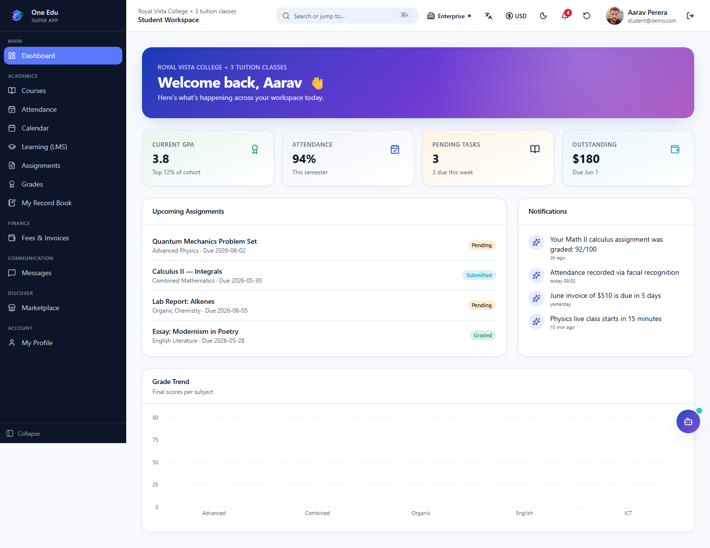 | 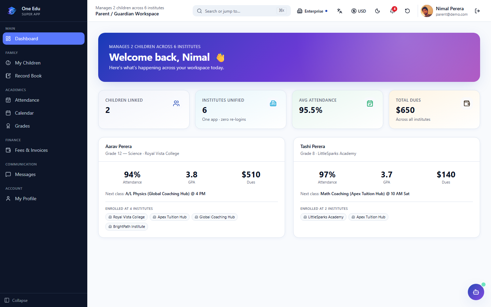 |
| *Student home — GPA, attendance, pending work, schedule.* | *Parent home — across all linked children and institutions.* |

| Teacher | Platform / Institute Admin |
|---|---|
| 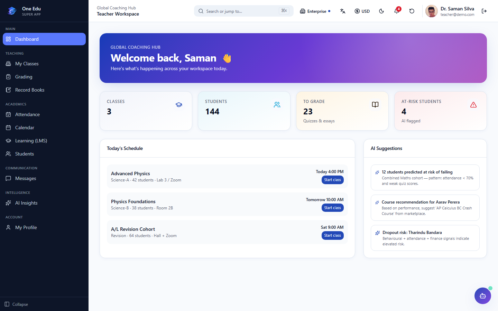 | 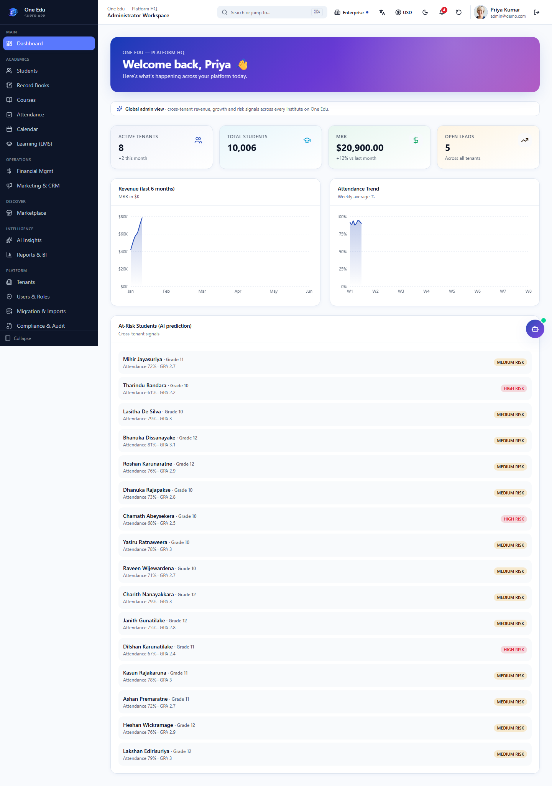 |
| *Teacher home — classes, today's sessions, quick actions.* | *Admin home — cross-tenant KPIs, trends, at-risk insights.* |

### 3.3 Subscription Tiers (commercial packaging)

| Plan | Module access | Indicative limit | Support |
|---|---|---|---|
| **Starter** | Core, Students, Courses, Attendance, Calendar | small institutions | Business hours |
| **Growth** | Starter + LMS, Grades, SRB, Finance, Messages, Reports | mid-sized | Extended hours |
| **Enterprise** | All modules + AI Insights, Marketplace, Migration, integrations | large / multi-campus | 24×7 |

---

## 4. Business Drivers & Product Objectives

| ID | Objective | Why it matters | Measured by |
|---|---|---|---|
| **OBJ-001** | Let an institution run academic + admin operations on one platform | Reduces tool sprawl; single source of truth | Modules adopted per tenant |
| **OBJ-002** | Guarantee per-tenant data isolation | Trust is the precondition for adoption | Zero cross-tenant data incidents |
| **OBJ-003** | Be compliant with children's-data law in every served jurisdiction | Legal precondition to operate | Passed DPIA & audit per region |
| **OBJ-004** | Keep each tenant's data in its own jurisdiction | Contractual & legal residency obligations | Residency attestations issued |
| **OBJ-005** | Onboard a new institution quickly and safely | Growth & operational cost | Time-to-onboard |
| **OBJ-006** | Make day-to-day tasks fast and convenient, **mobile-first**, for teachers, students and parents | Most usage is on phones; adoption & retention depend on it | Mobile task completion time, app-store rating, NPS |
| **OBJ-007** | Let institutions migrate off their existing LMS/SIS (e.g. Moodle) with minimal friction | Migration effort is a top barrier to switching | Successful migrations, time-to-migrate |

---

## 5. Functional Requirements

> Each subsection states the feature, the stakeholder need it serves, and the testable requirements. Requirements describe behaviour and rules, independent of implementation.
>
> **About the screenshots.** The figures in this section are taken from the interactive prototype and are included to illustrate the intended functionality and user experience of each module. They are indicative of look-and-feel and scope — the binding requirements are the numbered statements, not the pixels.

### 5.1 Identity & Access Management

**Need:** Every user must be reliably identified and given access only to what their role and tenant permit.

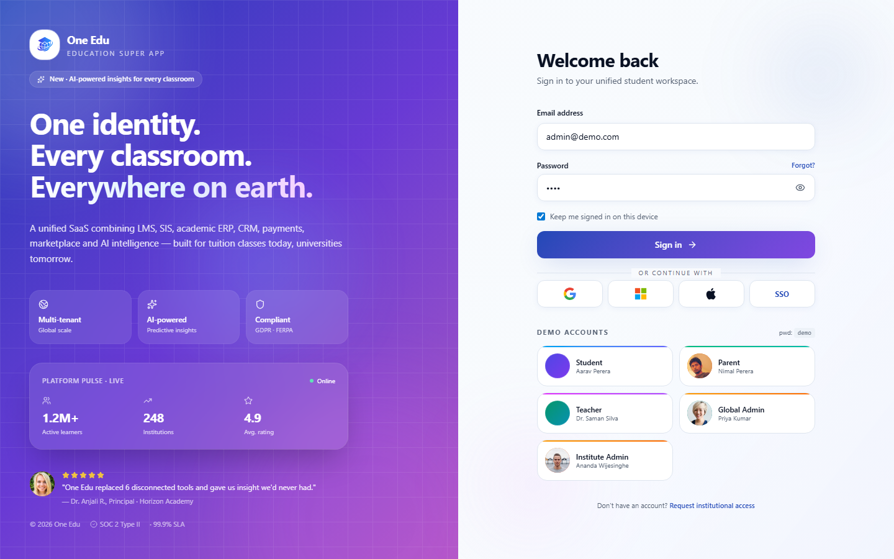
*Figure 5.1a — Sign-in: password, federated SSO (Google/Microsoft/Apple/SSO), and role-based demo accounts.*

| ID | Requirement |
|---|---|
| **AUTH-001** | The system SHALL authenticate users by email/username and password, and SHALL store passwords only as salted, computationally-hard hashes — never in recoverable form. |
| **AUTH-002** | The system SHALL support federated sign-in via external identity providers (e.g. Microsoft, Google) using industry-standard protocols (OAuth 2.0 / OIDC / SAML 2.0). |
| **AUTH-003** | The system SHALL require multi-factor authentication for all administrative roles (Institute Admin, Platform Admin, Compliance Officer) and SHALL allow it to be enabled for other roles. |
| **AUTH-004** | The system SHALL support at least: time-based one-time passwords (authenticator apps) and FIDO2/WebAuthn security keys. SMS codes MAY be offered only as a fallback. |
| **AUTH-005** | The system SHALL maintain authenticated sessions with limited lifetime and SHALL allow a user to view and revoke their active sessions. |
| **AUTH-006** | The system SHALL lock an account after a configurable number of consecutive failed sign-in attempts and SHALL notify the user. |
| **AUTH-007** | The system SHALL enforce a configurable password policy (minimum length, breached-password rejection, no reuse of recent passwords). |
| **AUTH-008** | The system SHALL provide secure self-service password reset and SHALL invalidate existing sessions on password change. |
| **AUTH-009** | The system SHALL support single sign-out that ends the session across the application and federated identity provider. |
| **AUTH-010** | Every authorisation decision SHALL be enforced on the server. The user interface MAY hide unavailable actions, but hiding SHALL NOT be the sole control. |

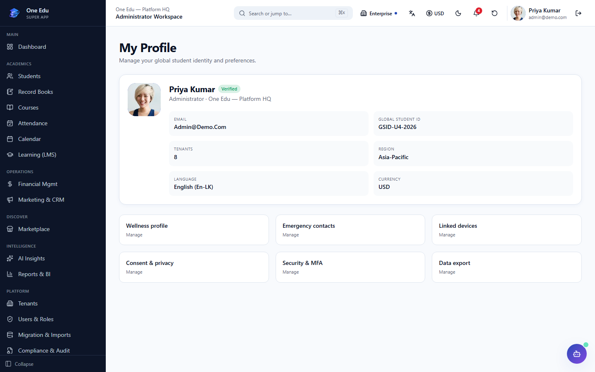
*Figure 5.1b — User profile & account/security settings.*

### 5.2 Multi-Tenancy & Data Isolation *(data-security foundation)*

**Need:** As a shared platform, One Edu must make it impossible for one institution to access another's data, and must let each institution configure its own space. *(Drivers: OBJ-002, CON-002.)*

| ID | Requirement |
|---|---|
| **MT-001** | The system SHALL represent each institution as an isolated tenant with its own data boundary. All tenant data SHALL be attributable to exactly one tenant. |
| **MT-002** | The system SHALL enforce tenant isolation on the server for every data-access operation, such that no request can return or modify data belonging to a tenant other than the caller's. |
| **MT-003** | Cross-tenant data access SHALL be possible only for the Platform Admin role, only through explicitly audited operations, and never through ordinary tenant-facing endpoints. |
| **MT-004** | Files and media SHALL be stored within the owning tenant's boundary, and access SHALL be granted only via short-lived, tenant-scoped, least-privilege links. |
| **MT-005** | Each tenant SHALL be configurable for: institution name, logo, brand colour, timezone, locale, currency, and academic-calendar structure. |
| **MT-006** | Each tenant SHALL have its own access space (a unique subdomain) and MAY use a custom domain with automatically provisioned TLS. |
| **MT-007** | Tenant onboarding SHALL be an automated workflow: verify the institution → assign geo-region → provision the tenant's isolated data space → seed initial configuration → invite the first administrator. |
| **MT-008** | Tenant offboarding SHALL enforce a defined retention window, then irreversibly delete all of that tenant's data across every store, and SHALL produce a signed deletion certificate. |
| **MT-009** | A tenant's enabled modules, plan, and customisations SHALL be stored server-side and SHALL be the authoritative source for entitlement decisions (§5.4). |

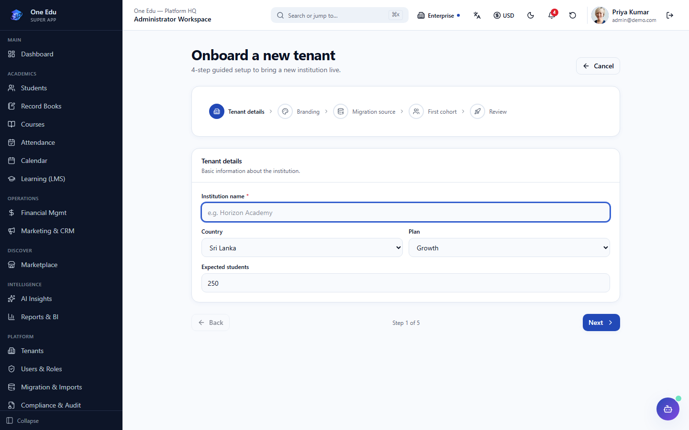
*Figure 5.2a — Automated tenant onboarding workflow (MT-007).*

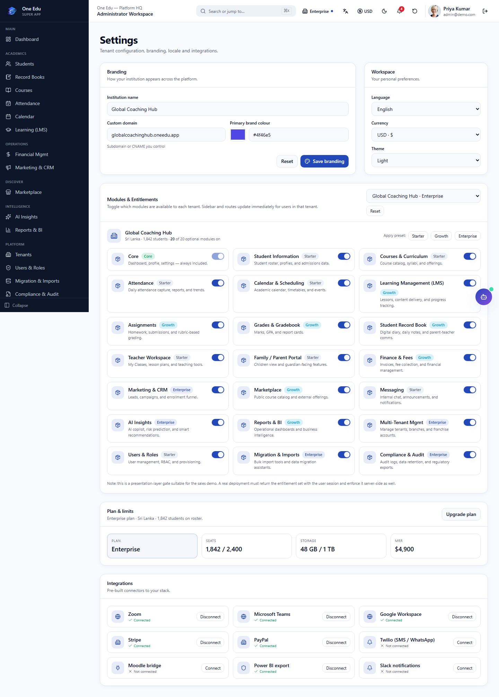
*Figure 5.2b — Per-tenant configuration: branding, locale, currency, modules (MT-005).*

### 5.3 Data Residency & Geo-Separation

**Need:** Each institution's personal data must remain in the jurisdiction that law or contract requires. *(Drivers: OBJ-004, CON-001.)*

| ID | Requirement |
|---|---|
| **GEO-001** | The system SHALL assign each tenant to a geo-region at onboarding, based on the tenant's declared jurisdiction, and SHALL record that assignment. |
| **GEO-002** | All personal data for a tenant SHALL be stored and processed within its assigned geo-region. The system SHALL NOT replicate personal data outside that region except under a recorded, lawful transfer mechanism. |
| **GEO-003** | Backups of a tenant's data SHALL reside within the same regulatory jurisdiction as the primary data. |
| **GEO-004** | Any analytics or AI processing of a tenant's personal data SHALL occur within the tenant's geo-region. |
| **GEO-005** | The system SHALL NOT cache personal data in shared global infrastructure (e.g. a CDN). Only non-personal static assets MAY be globally cached. |
| **GEO-006** | The system SHALL let a tenant query where its data is stored and obtain a signed data-residency attestation. |
| **GEO-007** | A platform-level control plane MAY hold only non-personal tenant metadata (identifier, region, plan, status) required to route and bill; it SHALL hold no student personal data or educational records. |
| **GEO-008** | Tenant-initiated migration between regions SHALL be supported as a controlled procedure with export, review, import, validation, and verified deletion of the source data. |

### 5.4 Subscription & Module Entitlement

**Need:** Tenants should access exactly the features their plan grants, enforced reliably.

| ID | Requirement |
|---|---|
| **MOD-001** | The system SHALL organise functionality into independently enableable modules and SHALL allow each tenant's enabled set to be configured according to its subscription. |
| **MOD-002** | Module entitlement SHALL be enforced on the server for every protected operation. A request for a disabled module SHALL be rejected and recorded. |
| **MOD-003** | The user interface SHALL present only entitled modules, but SHALL treat UI gating as a convenience, not a security control. |
| **MOD-004** | The Platform Admin SHALL control entitlements per tenant; an Institute Admin MAY toggle modules only within the limits of the tenant's plan. |
| **MOD-005** | A change to a tenant's plan or entitlements SHALL take effect for active users promptly, without requiring sign-out. |
| **MOD-006** | Module usage SHALL be measurable per tenant to support billing and capacity planning, processed within the tenant's geo-region. |

### 5.5 Student Information

**Need:** A trustworthy record of each student, their guardians, and their enrolment(s).

| ID | Requirement |
|---|---|
| **STU-001** | The system SHALL maintain a student profile including: legal name, preferred name, date of birth, gender (inclusive options), nationality, photo (consent-gated), contact details, guardian relationships, medical notes (treated as special-category), SEN flags, and dietary requirements. |
| **STU-002** | The system SHALL assign every student a platform-wide, immutable One Edu ID at first enrolment, persisting across transfers between institutions. |
| **STU-003** | The system SHALL record guardian–student relationships with verification, and SHALL grant guardian portal access only to verified relationships. |
| **STU-004** | The system SHALL support a student being enrolled at more than one institution simultaneously, with each institution able to see only the data arising from its own relationship with the student; only the One Edu ID is shared. |
| **STU-005** | Capturing or displaying a student photo SHALL require a recorded guardian consent (with timestamp and consenting user). |
| **STU-006** | The system SHALL support bulk student import with field mapping, duplicate detection, a validation report, and a dry-run preview before commit. |
| **STU-007** | The system SHALL keep a full change history for student records (previous value, new value, who changed it, when). |
| **STU-008** | The system SHALL classify each student as a **minor** or an **adult** based on date of birth and the age of majority/digital-consent threshold of the tenant's jurisdiction (default 18; configurable per jurisdiction). |
| **STU-009** | An **adult student** MAY operate a fully **self-managed account** with no mandatory guardian link, and SHALL be able to perform on their own behalf: enrolment and course selection, fee payment, consent decisions, acknowledgements (e.g. SRB), and communications. Consents/acknowledgements that would otherwise require a guardian SHALL be given by the adult student directly. |
| **STU-010** | For a **minor student**, guardian linkage and guardian consent SHALL remain required as specified in STU-003, STU-005, and §9.3. |
| **STU-011** | When a minor reaches the age of majority, the system SHALL support **transition to a self-managed account**: the student SHALL gain self-management rights, and guardian access SHALL be reduced or removed per tenant policy and applicable law, with both parties notified. A guardian MAY retain access only with the adult student's explicit consent. |

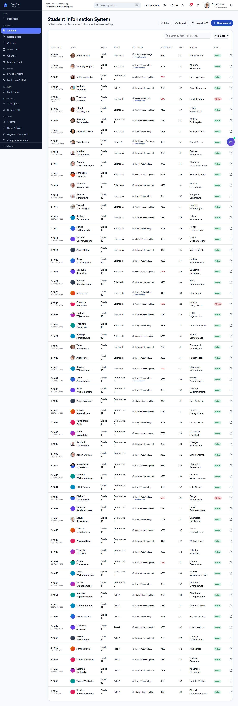
*Figure 5.5a — Student information: searchable roster with One Edu ID, enrolments, and flags.*

#### 5.5.1 Cross-Tenant Enrolment (consent-gated discovery)

**Need:** A student already on One Edu may approach a *different* institution to enrol (e.g. an extra tuition class). That institution's admin must be able to find and enrol the existing student **without** being able to see any of the student's data held by other tenants — and the student (if adult) or guardian (if minor) must explicitly approve before the new institution gets any access. *(Drivers: OBJ-002, MT-002; privacy-by-design.)*

| ID | Requirement |
|---|---|
| **ENR-001** | A tenant admin SHALL be able to search for an existing One Edu student **only** by an exact-match identifier the requester already holds: registered email **or** One Edu ID / reference number. Fuzzy or browse-style discovery across the platform SHALL NOT be possible. |
| **ENR-002** | A successful lookup SHALL return a **minimal availability result only** — confirmation that an account exists and can be invited to enrol. It SHALL NOT disclose the student's profile, contact details, other institutions, enrolments, grades, records, or any other tenant's data. |
| **ENR-003** | To proceed, the admin SHALL raise an **enrolment request** (selecting the target course/class). Raising a request SHALL grant the requesting tenant **no access** to the student's data. |
| **ENR-004** | The system SHALL notify the approver — the **adult student** (per STU-009) or the **minor's verified guardian** (per STU-010) — via **email and SMS**, requesting explicit confirmation of the enrolment. |
| **ENR-005** | Confirmation SHALL require **explicit authorisation** via a secure one-click confirmation link and/or a one-time passcode (OTP). The request SHALL **expire** if not confirmed within a configurable window (default 72 hours). |
| **ENR-006** | **Only after** the approver confirms SHALL the enrolment be created in the requesting tenant. At that point — and not before — that tenant SHALL gain access strictly to the data arising from its own relationship with the student (consistent with tenant isolation, MT-002). |
| **ENR-007** | If the request is declined or expires, no enrolment SHALL be created and the requesting tenant SHALL gain no access; the outcome SHALL be recorded. |
| **ENR-008** | All cross-tenant lookups, enrolment requests, confirmations, declines, and expiries SHALL be **audit-logged** (requester, target One Edu ID, action, outcome, timestamp) on both the requesting tenant and the student's home record. |

### 5.6 Courses & Learning (LMS)

| ID | Requirement |
|---|---|
| **CRS-001** | The system SHALL let staff create and manage courses with: title, description, subject, year group, assigned teacher(s), capacity, enrolment period, and status (draft/active/archived). |
| **CRS-002** | The system SHALL deliver learning content to enrolled students and SHALL support standard e-learning content packages. |
| **CRS-003** | The system SHALL version course content and allow rollback to a previous version without data loss. |
| **CRS-004** | The system SHALL track learner progress (completion, time-on-content, assessment results) per student per course. |
| **CRS-005** | The system SHALL manage enrolment of students into courses, including waitlists where capacity is exceeded. |

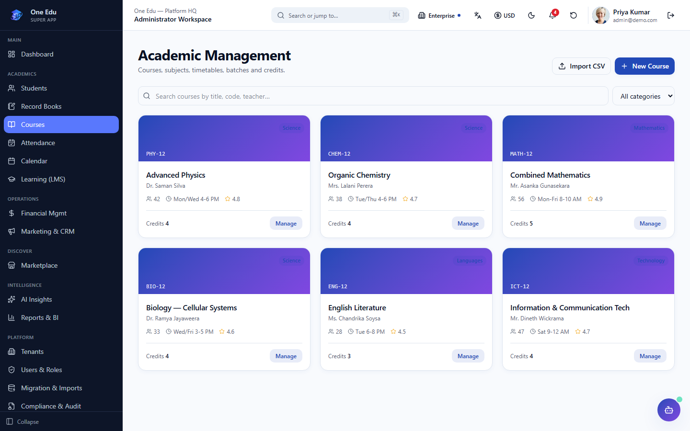
*Figure 5.6a — Course catalogue & management (CRS-001).*

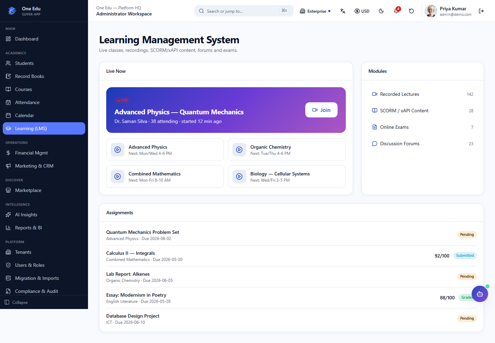
*Figure 5.6b — LMS content delivery and learner progress (CRS-002/004).*

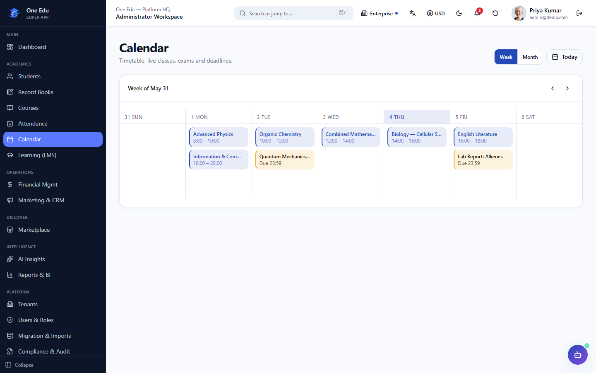
*Figure 5.6c — Academic calendar & scheduling.*

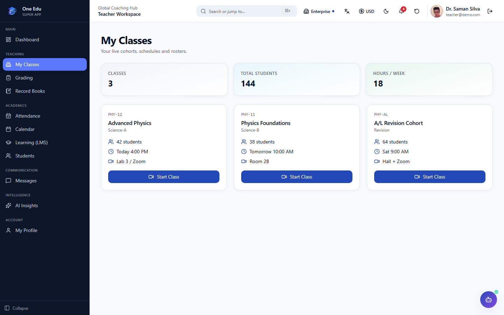
*Figure 5.6d — Teacher's class overview and quick actions.*

### 5.7 Attendance

**Need:** Flexible attendance capture that respects consent and child-data law — especially for biometric methods. *(Driver: §9.)*

| ID | Requirement |
|---|---|
| **ATT-001** | The system SHALL support multiple capture methods: manual marking, QR-code, card/RFID tap, GPS geofence, and facial recognition. |
| **ATT-002** | Biometric capture methods SHALL be disabled by default and SHALL be enableable only after a completed, approved DPIA for that tenant. |
| **ATT-003** | Enabling a biometric or location-based method for a student SHALL require explicit, recorded consent, with an opt-out that does not disadvantage the student. |
| **ATT-004** | Biometric processing SHALL occur within the tenant's geo-region and biometric templates SHALL NOT leave that boundary. |
| **ATT-005** | A confirmed attendance record SHALL be immutable; corrections SHALL create a linked correcting record carrying a reason and the authorising user. |
| **ATT-006** | The system SHALL generate configurable absence alerts to guardians (in-app, email, and/or SMS) once a threshold is reached. |
| **ATT-007** | The system SHALL produce attendance summaries and registers per class, student, and period. |

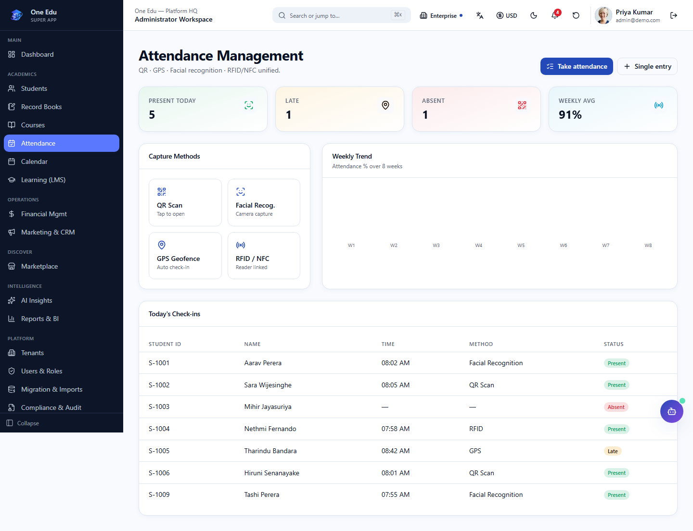
*Figure 5.7a — Attendance dashboard with multi-modal capture (ATT-001).*

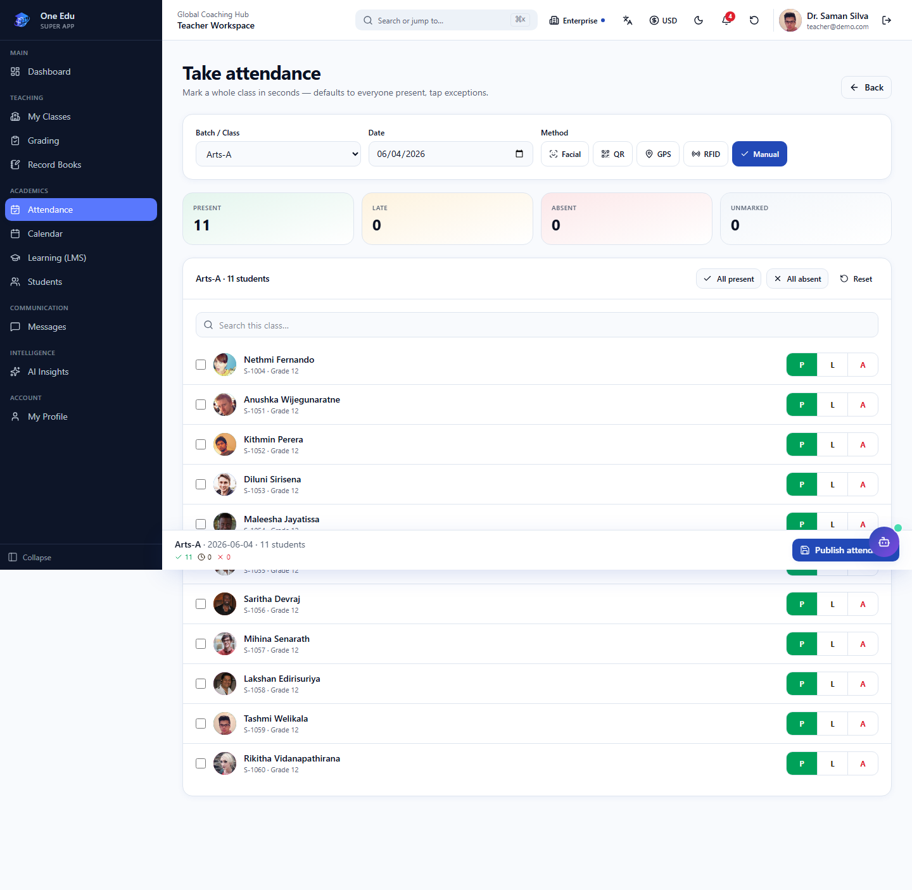
*Figure 5.7b — Taking a register (manual / QR / RFID / facial — biometric gated by DPIA & consent, ATT-002/003).*

### 5.8 Grades & Assignments

| ID | Requirement |
|---|---|
| **GRD-001** | The system SHALL support configurable grading schemes per course (percentage, letter grade, GPA, custom rubric). |
| **GRD-002** | The system SHALL accept assignment submissions as file upload, text entry, or external link, within a configurable size limit. |
| **GRD-003** | The system SHALL record submission timestamps and flag late submissions against a due date. |
| **GRD-004** | The system SHALL let teachers grade, annotate, and return feedback, and SHALL notify the student. |
| **GRD-005** | The system SHALL produce gradebooks and SHALL export them in common formats (CSV, PDF, spreadsheet). |
| **GRD-006** | The system MAY integrate plagiarism detection as an optional add-on for higher tiers. |

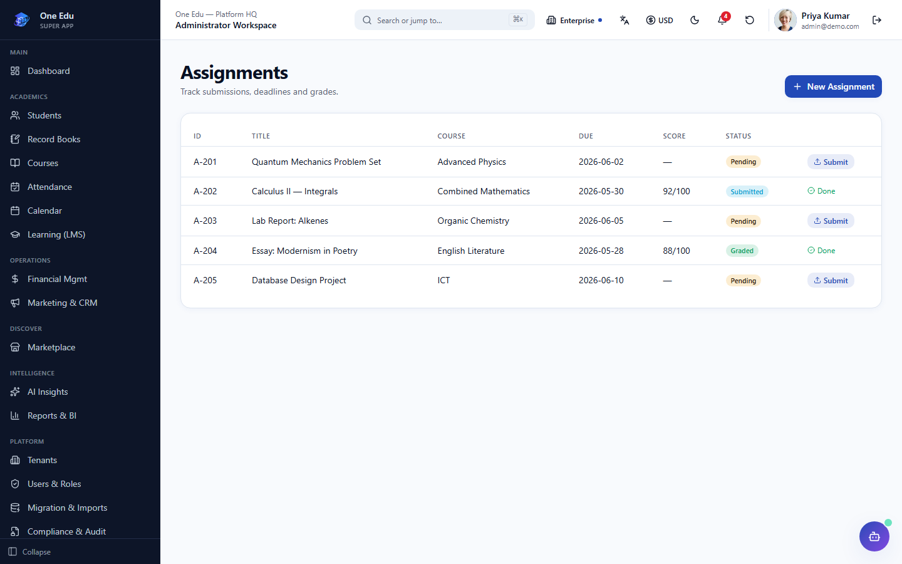
*Figure 5.8a — Assignments: submission types, due dates, late flags (GRD-002/003).*

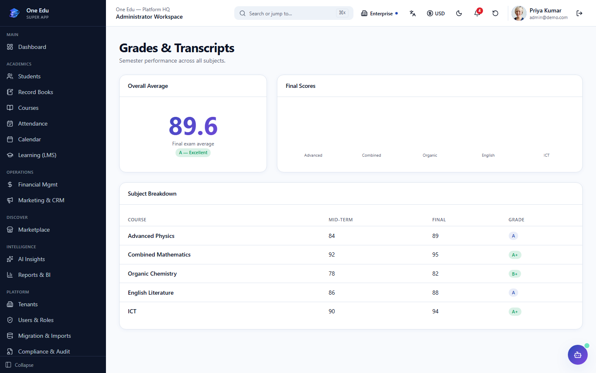
*Figure 5.8b — Gradebook with configurable grading schemes (GRD-001/005).*

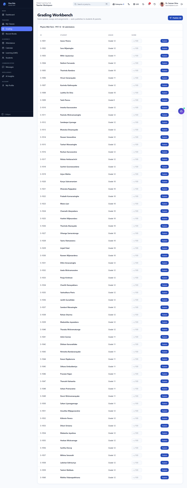
*Figure 5.8c — Teacher grading & feedback workflow (GRD-004).*

### 5.9 Student Record Book (SRB)

**Need:** A structured welfare and communication log, with special handling for safeguarding.

| ID | Requirement |
|---|---|
| **SRB-001** | The system SHALL support entry types including: academic note, behaviour (positive/concern), health & wellbeing, homework log, safeguarding flag, permission slip, and general communication. |
| **SRB-002** | Safeguarding entries SHALL be visible only to authorised safeguarding roles (e.g. DSL), SHALL NOT be visible to the student or guardian without DSL approval, and SHALL trigger immediate notification to the DSL. |
| **SRB-003** | Entries requiring guardian acknowledgement SHALL record who acknowledged, when, and SHALL escalate if unacknowledged after a configurable period. |
| **SRB-004** | SRB records SHALL be retained for at least the statutory minimum of the tenant's jurisdiction, configurable per entry type but never below that floor. |
| **SRB-005** | Safeguarding entries SHALL NOT be included in any data export (including DSAR fulfilment) without DSL review. |
| **SRB-006** | For an **adult, self-managed student** (STU-009), entries requiring acknowledgement SHALL be acknowledged by the **student themselves**, and the record SHALL capture the student as the acknowledging party (no guardian acknowledgement is required or solicited). For minors, acknowledgement remains the guardian's responsibility per SRB-003. |

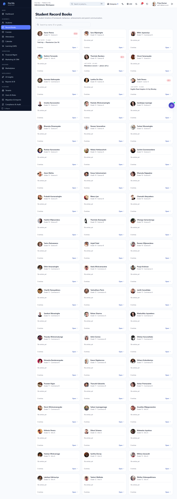
*Figure 5.9a — SRB: typed welfare/behaviour entries, acknowledgements, safeguarding flags (SRB-001/002).*

### 5.10 Finance

| ID | Requirement |
|---|---|
| **FIN-001** | The system SHALL support multi-currency fee management and invoicing. |
| **FIN-002** | The system SHALL integrate with PCI-DSS-certified payment gateways appropriate to each tenant's region, and SHALL NOT store raw card data (CON-003). |
| **FIN-003** | The system SHALL support fee-schedule templates, discount codes, sibling discounts, and scholarship/fee waivers. |
| **FIN-004** | The system SHALL generate invoices and receipts compliant with the tax/e-invoicing rules of the tenant's jurisdiction. |
| **FIN-005** | The system SHALL track invoice status (issued, paid, overdue, refunded) and SHALL produce financial reports and reconciliation views. |
| **FIN-006** | Guardians (for minors) and **adult students themselves** (per STU-009) SHALL be able to view and pay invoices through the portal. |

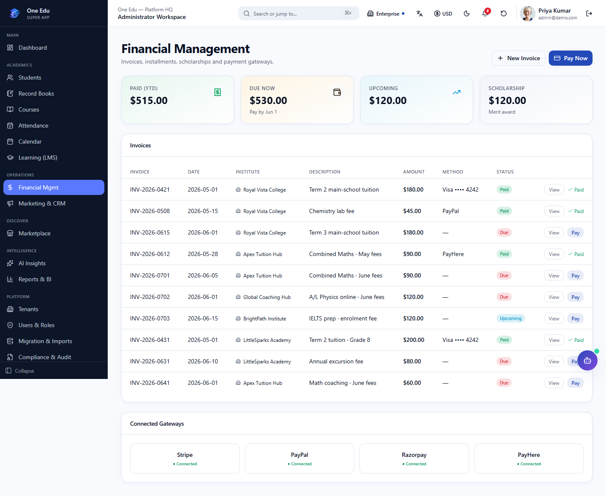
*Figure 5.10a — Fee management, invoicing and collection status (FIN-001/005).*

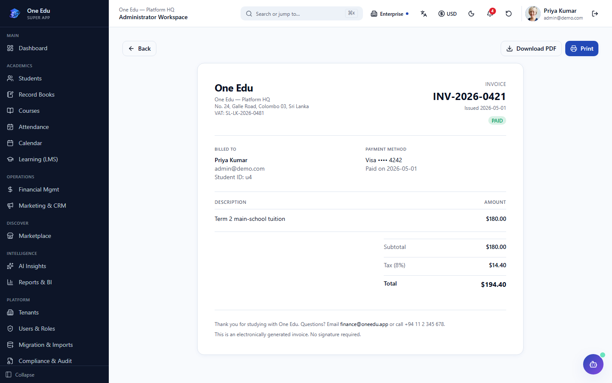
*Figure 5.10b — Invoice detail with gateway-based payment (FIN-002/006); no card data stored (CON-003).*

### 5.11 Communications

| ID | Requirement |
|---|---|
| **MSG-001** | The system SHALL provide in-app messaging, scoped strictly within a tenant; cross-tenant messaging SHALL NOT be possible. |
| **MSG-002** | The system SHALL deliver notifications via in-app, email, SMS, and push (where a device token is registered), per user preference. |
| **MSG-003** | The system SHALL support targeted announcements (class-, year-, or school-wide), rate-limited to prevent flooding. |
| **MSG-004** | Message content SHALL be stored within the tenant's geo-region; message metadata SHALL be retained per the tenant's retention policy for audit. |
| **MSG-005** | Users SHALL be able to manage their notification preferences and channels. |

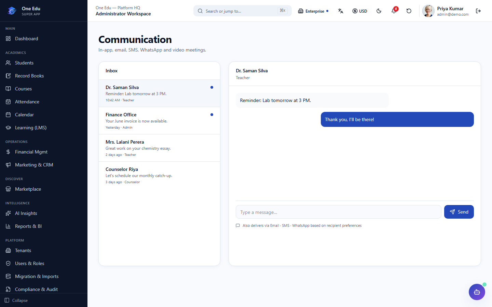
*Figure 5.11a — Tenant-scoped in-app messaging & notifications (MSG-001/002).*

### 5.12 AI Insights

**Need:** Assistive analytics that help staff, without making automated decisions about children. *(Driver: §9, Children's Code.)*

| ID | Requirement |
|---|---|
| **AI-001** | AI features SHALL operate on a tenant's own data only and SHALL NOT use one tenant's data to train models serving others. |
| **AI-002** | AI processing of personal data SHALL occur within the tenant's geo-region. |
| **AI-003** | Any AI-generated insight about an individual student (e.g. an "at-risk" indicator) SHALL require a staff member to review and confirm before it is acted upon or surfaced; fully automated decisions affecting students SHALL be prohibited. |
| **AI-004** | Each AI insight SHALL include a plain-language explanation of the factors behind it. |
| **AI-005** | The system SHALL present a transparency notice to guardians explaining how AI is used. |

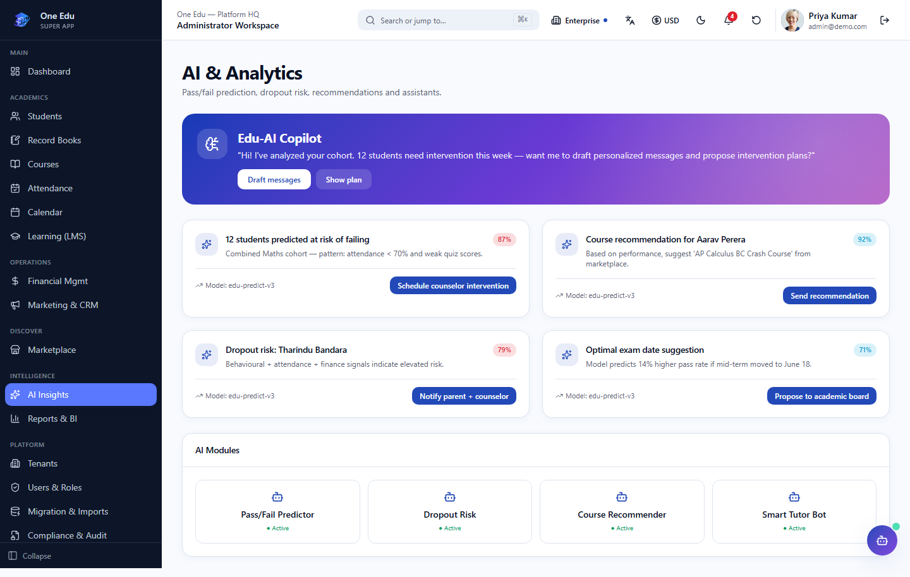
*Figure 5.12a — AI insights with explanations and human-in-the-loop confirmation (AI-003/004).*

### 5.13 Family Portal

| ID | Requirement |
|---|---|
| **FAM-001** | A verified guardian SHALL be able to view, for each linked child: timetable, attendance, grades, homework, SRB items intended for guardians, and invoices. |
| **FAM-002** | A guardian linked to children at more than one institution SHALL be able to switch between them within a single account, with each institution's data shown separately. |
| **FAM-003** | Guardians SHALL be able to acknowledge SRB items, message staff, and pay invoices from the portal. |
| **FAM-004** | Guardian access SHALL be read-only with respect to academic records (no editing of grades/attendance). |
| **FAM-005** | The family portal applies to **minors with a verified guardian link**. **Adult students** (STU-009) manage their own account directly and have no mandatory guardian; any guardian access to an adult student's record SHALL exist only with that student's explicit consent (STU-011). |

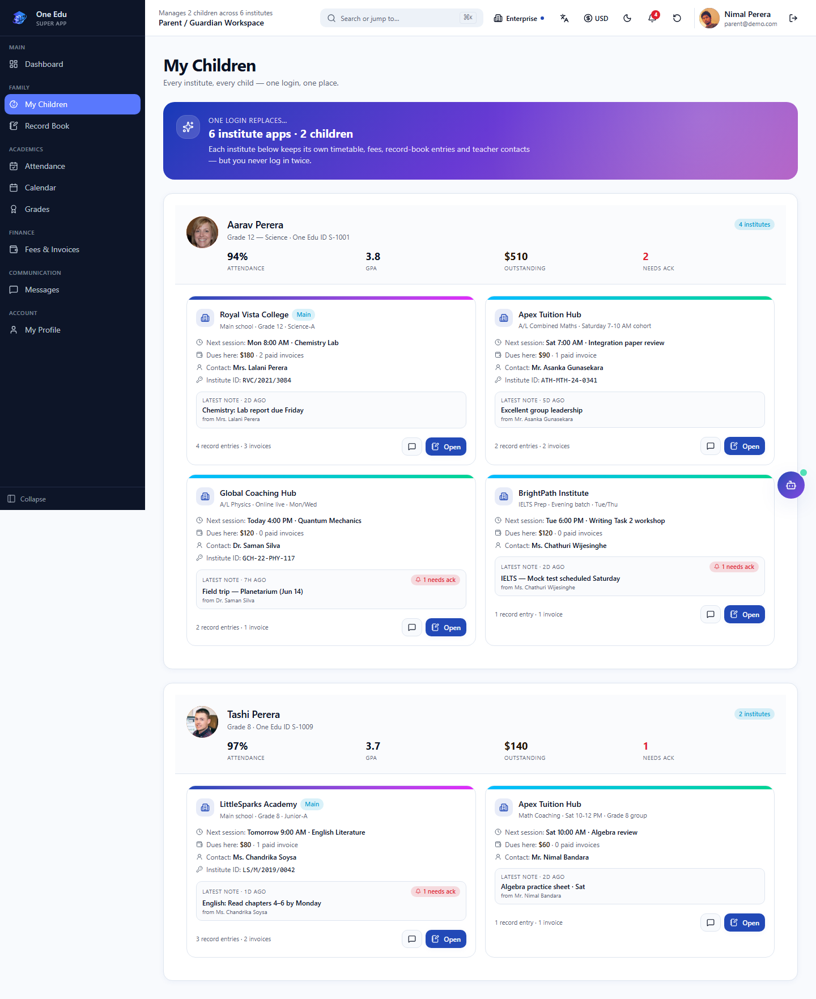
*Figure 5.13a — Guardian view across multiple linked children/institutions (FAM-001/002).*

### 5.14 Marketplace

| ID | Requirement |
|---|---|
| **MKT-001** | A tenant MAY opt in to publish courses discoverable by students across the platform network. |
| **MKT-002** | Cross-institution discovery SHALL share only the published catalogue; all transactional and enrolment data SHALL remain within each respective tenant's boundary. |
| **MKT-003** | Inter-tenant interactions SHALL occur only through authenticated, encrypted platform services, never via direct cross-tenant data access. |

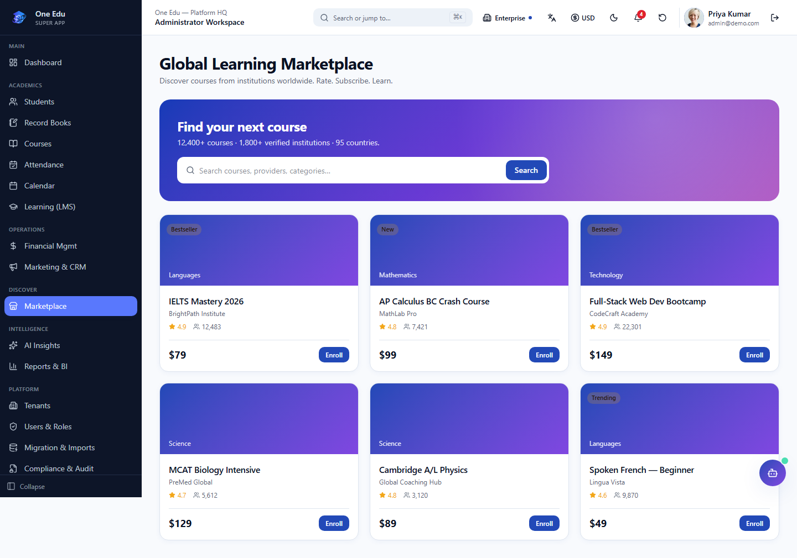
*Figure 5.14a — Cross-institution course Marketplace (opt-in), with isolation preserved (MKT-001/002).*

### 5.15 Reporting & Analytics

| ID | Requirement |
|---|---|
| **RPT-001** | The system SHALL provide role-appropriate dashboards (e.g. attendance trends, grade distributions, fee collection, enrolment). |
| **RPT-002** | The system SHALL support exporting reports in common formats with configurable fields. |
| **RPT-003** | Large exports SHALL be processed asynchronously and delivered via a secure, expiring download link. |
| **RPT-004** | Platform-level aggregate reporting SHALL be produced without direct cross-tenant access to live transactional data. |

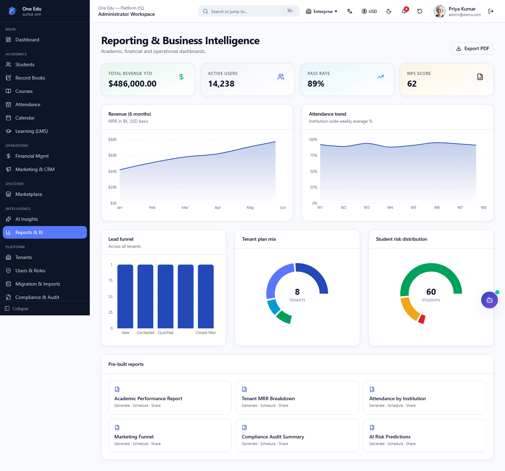
*Figure 5.15a — Operational & academic dashboards with export (RPT-001/002).*

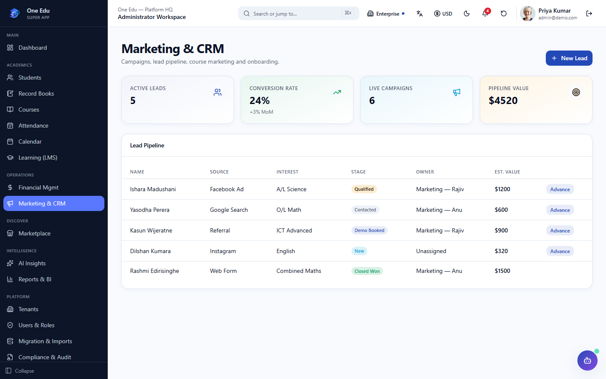
*Figure 5.15b — Admissions / marketing CRM: lead pipeline and engagement analytics.*

### 5.16 Platform Administration

| ID | Requirement |
|---|---|
| **ADM-001** | Platform Admins SHALL have a dedicated administration interface, separate from the tenant-facing application, with its own authentication. |
| **ADM-002** | Platform Admins SHALL be able to create, suspend, and delete tenants; manage plans and entitlements; and view cross-tenant operational metrics. |
| **ADM-003** | Every Platform Admin action SHALL be recorded in an audit log (actor, action, affected tenant, time, outcome). |
| **ADM-004** | Emergency ("break-glass") access by an operator to a tenant's data SHALL require multi-party approval, notify the tenant, be time-limited, and be fully audited. |
| **ADM-005** | The system SHALL provide operational health dashboards per region (availability, latency, error rates, capacity). |

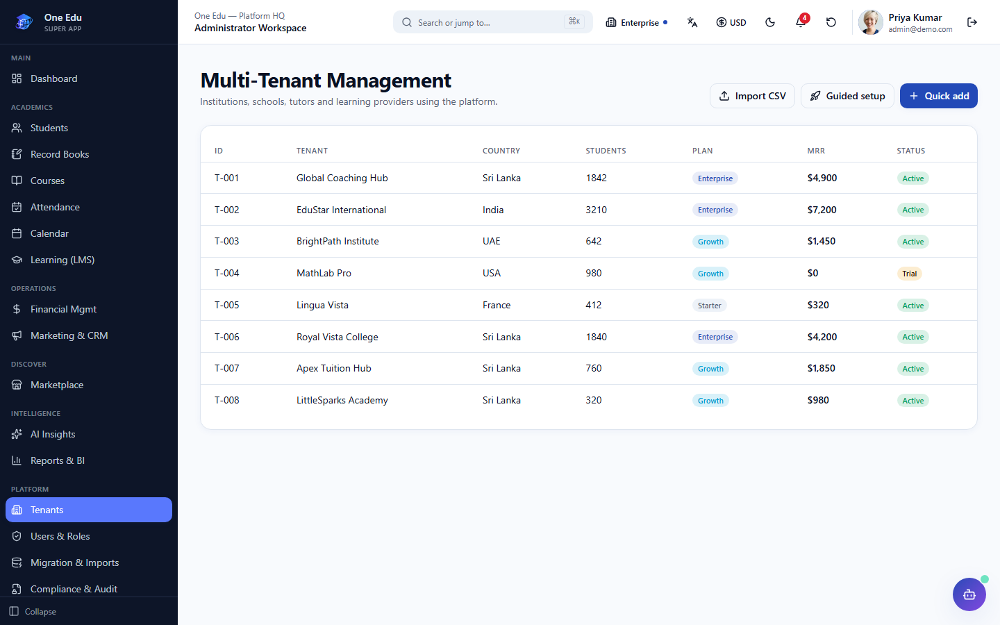
*Figure 5.16a — Platform admin: tenant lifecycle and plan/entitlement management (ADM-002).*

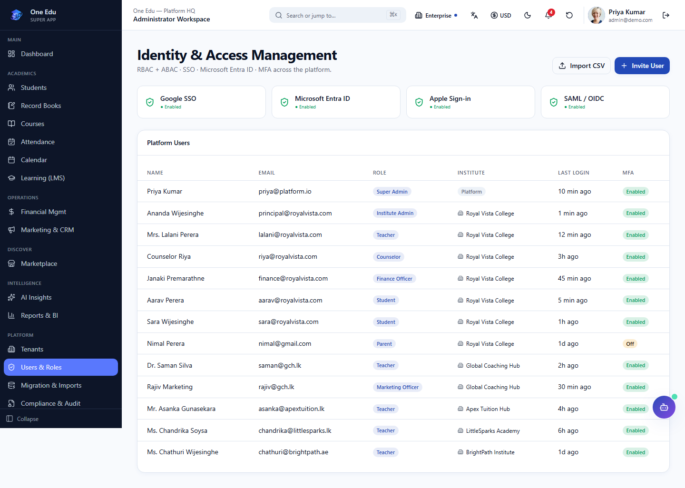
*Figure 5.16b — User & role administration with MFA status (ADM-003).*

### 5.17 Data Migration & Legacy LMS Integration

**Need:** Institutions already running another LMS/SIS (most commonly **Moodle**) must be able to bring their existing data into One Edu with minimal manual effort, so migration is not a barrier to adoption.

| ID | Requirement |
|---|---|
| **MIG-001** | The system SHALL import students, guardians, staff, courses, enrolments, and historical grades/attendance from standard formats (CSV/JSON/Excel). |
| **MIG-002** | The system SHALL provide a dedicated **migration integration for existing LMS/SIS platforms**, supporting at minimum **Moodle**, and SHALL be extensible to others (e.g. Google Classroom, Canvas, Blackboard). |
| **MIG-003** | For Moodle specifically, the system SHALL ingest data via Moodle's supported mechanisms (e.g. Moodle Web Services API and/or Moodle course/user backup exports), importing: users (students/teachers), courses and categories, enrolments, course content/resources, assignments, grades/gradebook, and activity completion. |
| **MIG-004** | The migration tool SHALL provide a **field/entity mapping interface** so source fields and roles from the legacy system are mapped to One Edu equivalents before import. |
| **MIG-005** | The system SHALL retain a mapping to each source system's original identifiers (and source system name) for post-migration reconciliation and rollback. |
| **MIG-006** | Every import SHALL produce a **pre-commit validation report** (counts, errors by row, duplicate detection, mapping warnings) and SHALL support a dry-run preview before commit. |
| **MIG-007** | Imports SHALL be **idempotent** — re-running the same source SHALL NOT create duplicates. |
| **MIG-008** | Large migrations SHALL run **asynchronously** with real-time progress, and SHALL support pause/resume and a post-migration summary/reconciliation report. |
| **MIG-009** | All migrated data SHALL be written directly into the tenant's isolated boundary and geo-region (MT-001, GEO-002); no migrated personal data SHALL transit or be staged outside that region. |

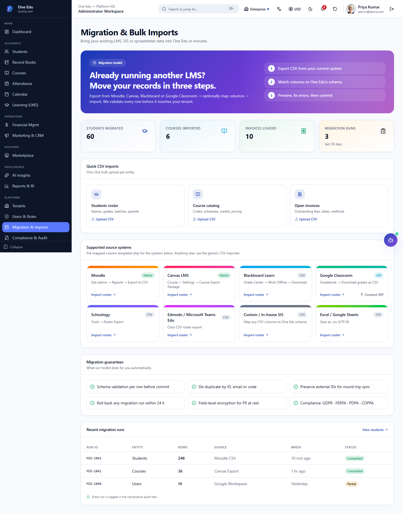
*Figure 5.17a — Migration workspace: import from Moodle/legacy systems with mapping & validation (MIG-002/003/006).*

### 5.18 Compliance & Governance

**Need:** The institution (controller) and the operator (processor) must be able to demonstrate and exercise data-protection compliance. *(Driver: §9.)*

| ID | Requirement |
|---|---|
| **CMP-001** | The compliance capability SHALL be available to every tenant: a dashboard for admins and a management interface for compliance officers. |
| **CMP-002** | The system SHALL maintain a tamper-evident, append-only audit log of security-significant events (sign-in/out, failed auth, permission and configuration changes, exports, DSAR actions). |
| **CMP-003** | The system SHALL manage the full DSAR lifecycle — intake, identity verification, assembly, review, delivery, closure — with jurisdiction-configurable SLA timers. |
| **CMP-004** | DSAR assembly SHALL gather a data subject's records across all modules; safeguarding entries SHALL require DSL review before inclusion. |
| **CMP-005** | The system SHALL record the lawful basis and consent for each processing activity, track consent withdrawal, and trigger erasure workflows on valid requests. |
| **CMP-006** | The system SHALL produce a Record of Processing Activities report per tenant in a machine-readable format. |
| **CMP-007** | The system SHALL enforce data-retention policies automatically, purging records past their retention period and producing a deletion report. |
| **CMP-008** | The system SHALL track DPIAs for high-risk processing (biometrics, AI profiling) and SHALL block enabling such processing without an approved DPIA. |
| **CMP-009** | The system SHALL provide a breach-response workflow: detection/alerting on anomalous access, containment, impact assessment, and templated, jurisdiction-aware regulator/data-subject notification. |

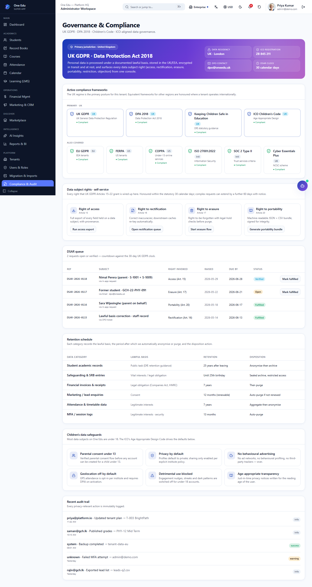
*Figure 5.18a — Governance dashboard: regulatory frameworks, data-subject rights, DSAR queue, retention schedule, children's-data safeguards, and audit trail (CMP-001…009).*

---

### 5.19 Native Mobile Application *(primary channel)*

**Need:** Most students, parents, and many teachers will interact with One Edu primarily through their phones. The mobile app must therefore be a first-class, polished product — not a wrapper around the website — and must make everyday tasks effortless. *(Drivers: OBJ-006, CON-004.)*

| ID | Requirement |
|---|---|
| **MOB-001** | The system SHALL be delivered as **native mobile applications for iOS and Android**, published to the Apple App Store and Google Play, with feature parity for all common end-user tasks (attendance, grades, SRB, messaging, family portal, fee payment, course access). |
| **MOB-002** | The mobile UI/UX SHALL be **mobile-first and role-aware**: each role lands on a home screen surfacing its most frequent actions, reachable in as few taps as possible. Common tasks (e.g. a parent checking attendance, a teacher marking a register) SHALL be completable without training. |
| **MOB-003** | The app SHALL follow each platform's interaction and accessibility conventions (iOS Human Interface Guidelines / Android Material), support light/dark themes, dynamic font sizes, and meet WCAG 2.1 AA (CON-005). |
| **MOB-004** | The app SHALL support **push notifications** for time-sensitive events (absence alerts, new grades, messages, SRB acknowledgements, payment reminders), with user-managed preferences (MSG-002). |
| **MOB-005** | The app SHALL support **biometric/device unlock** (Face ID / Touch ID / Android biometric) as a convenience layer over the standard authentication and MFA controls (§5.1). |
| **MOB-006** | The app SHALL provide **offline-tolerant** behaviour: recently viewed data (timetable, child records, class lists) SHALL remain viewable without connectivity, and actions taken offline (e.g. marking attendance) SHALL queue and sync when connectivity returns, with conflict handling. |
| **MOB-007** | The app SHALL reflect the tenant's branding and locale (language, currency, timezone) and SHALL respect data residency — the app SHALL connect only to the tenant's assigned geo-region (GEO-002). |
| **MOB-008** | The app SHALL support **multi-child / multi-institution accounts** in a single login, letting a parent switch between children and schools without re-authenticating (FAM-002). |
| **MOB-009** | The app SHALL support **in-app fee payment** via the integrated payment gateway (§5.10) using secure, gateway-hosted payment flows; raw card data SHALL never pass through the app (CON-003). |
| **MOB-010** | The app SHALL support **device/QR/RFID and (where enabled) camera-based capture** for attendance and check-in, subject to the same consent and DPIA controls as §5.7. |
| **MOB-011** | Mobile releases SHALL support a **minimum supported OS version policy** and SHALL handle forced-update prompts when a version is deprecated for security reasons. |
| **MOB-012** | No persisted personal data on the device SHALL be stored unencrypted; on sign-out or remote session revocation, locally cached personal data SHALL be cleared. |

The same experience adapts to a phone-sized, mobile-first layout:

| Student (mobile) | Family / children (mobile) | Fees & payment (mobile) |
|---|---|---|
| 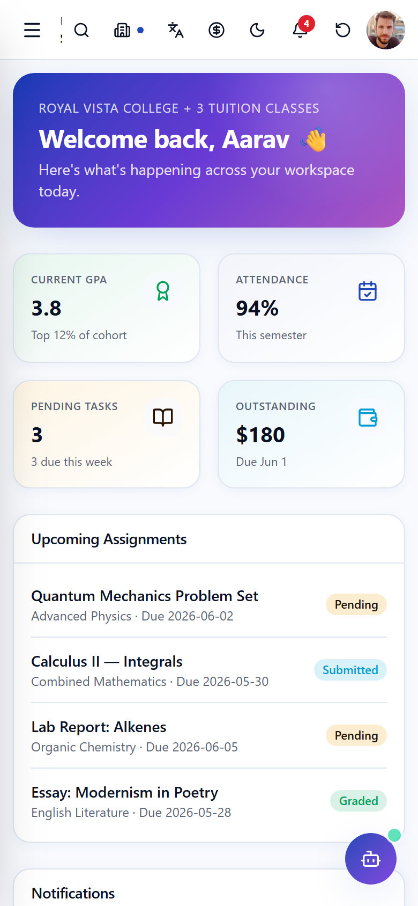 | 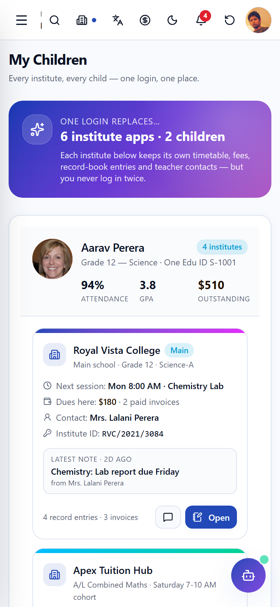 | 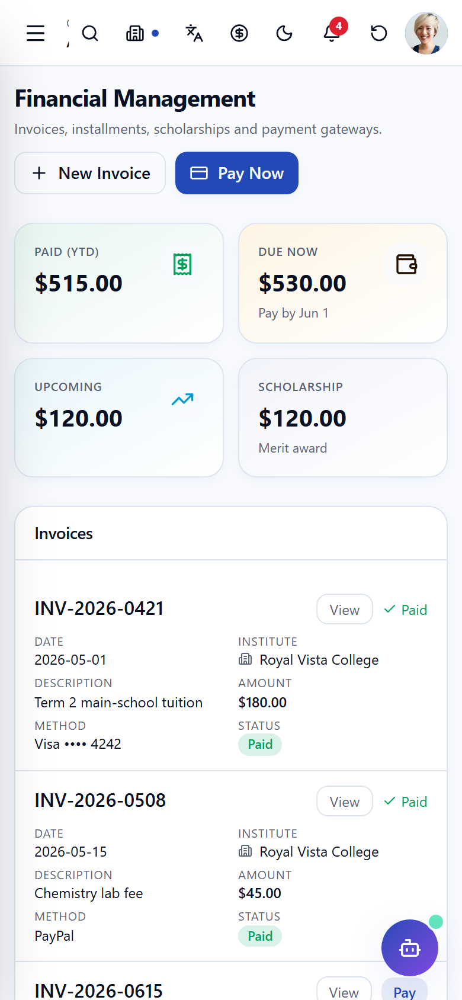 |
| *Mobile home — key info at a glance.* | *Switch between linked children.* | *In-app, gateway-based fee payment.* |

*Figures 5.19a–c — Mobile-first, role-aware layouts (MOB-002). Shown at phone viewport; native iOS/Android apps deliver these as first-class apps (MOB-001).*

---

## 6. Data Requirements

### 6.1 Key Data Entities (conceptual)

The conceptual model below defines *what* data exists and how it relates; physical schema design is deferred to the design phase.

- **Tenant** — institution; owns all tenant-scoped data; has region, plan, configuration.
- **User** — an account with one or more roles within a tenant (Platform Admin is cross-tenant).
- **Student** — has a One Edu ID; linked to Guardians; enrolled at one or more Tenants.
- **Guardian** — verified relationship to one or more Students.
- **Enrolment** — links a Student to a Tenant (and to Courses).
- **Course** — owned by a Tenant; has content, teachers, enrolled students, progress.
- **Assignment / Submission / Grade** — academic work and assessment.
- **AttendanceRecord** — per student per session; capture method; immutable once confirmed.
- **SRBEntry** — typed welfare/communication record; safeguarding subtype restricted.
- **Invoice / Payment / FeeSchedule** — finance.
- **Message / Notification / Announcement** — communications.
- **ConsentRecord / ProcessingActivity / DSAR / AuditLogEntry / DPIA / RetentionPolicy** — compliance.

### 6.2 Data Classification & Handling

| Classification | Examples | Handling |
|---|---|---|
| **Public** | Course catalogue, institution name | Encrypted in transit |
| **Internal** | Aggregate statistics | Encrypted in transit and at rest |
| **Confidential — PII** | Student name, DOB, contacts, grades | Encrypted in transit and at rest; access restricted by role and tenant |
| **Restricted — Special Category** | Medical notes, biometric data, safeguarding records, SEN | As above + field-level encryption + strictest access control + statutory retention |

### 6.3 Retention (defaults; configurable above the statutory floor)

| Data type | Default retention | Floor |
|---|---|---|
| Student academic records | Enrolment + 7 years | Duration of enrolment |
| Safeguarding / SRB | Per jurisdiction (e.g. 25 years UK) | Statutory minimum |
| Audit logs | 7 years | 2 years |
| Failed-login records | 90 days | — |
| Deleted user/tenant data | Defined recovery window, then purge | — |
| Financial records | Per jurisdiction (e.g. 7 years) | Statutory minimum |

---

## 7. External Interface Requirements

### 7.1 User Interfaces

| ID | Requirement |
|---|---|
| **UI-001** | The product SHALL be delivered as **native iOS and Android apps (primary channel, §5.19)** plus a responsive web application (installable as a PWA) for desktop/admin workflows. |
| **UI-002** | The UI SHALL be **mobile-first and role-aware**, optimised so the most frequent task for each role is reachable in minimal taps without training. |
| **UI-003** | Both web and mobile SHALL meet WCAG 2.1 AA. |
| **UI-004** | The UI SHALL reflect each tenant's branding (logo, colour, name) and locale (language, date/number/currency formats, timezone). |
| **UI-005** | The UI SHALL surface only the modules and actions the user is entitled to. |

### 7.2 Software Interfaces

| ID | Requirement |
|---|---|
| **API-001** | The system SHALL expose a versioned API for all client and integration use; breaking changes SHALL follow a deprecation policy. |
| **API-002** | A public integration API SHALL require scoped, per-module authorisation. |
| **API-003** | The system SHALL provide signed webhooks for key events (e.g. student enrolled, grade published, attendance recorded, invoice paid, DSAR submitted), with retry on failure. |
| **API-004** | The system SHALL apply rate limiting per tenant and per user, configurable by plan. |

### 7.3 Third-Party Service Categories

| Category | Purpose | Constraint |
|---|---|---|
| Identity providers | SSO / federation | Standard OAuth2/OIDC/SAML |
| Payment gateways | Fee collection | PCI-DSS certified; region-appropriate |
| Email/SMS providers | Notifications | Region-appropriate |
| AI inference service | AI Insights | Must run within tenant geo-region |
| Push notification services | Mobile/PWA alerts | — |
| Mobile app stores | Native app distribution (iOS App Store, Google Play) | Store policy & data-safety disclosures |
| Legacy LMS/SIS connectors | Data migration source (Moodle API/backup; others) | Read access to the source institution's data |

---

## 8. Non-Functional Requirements

### 8.1 Performance & Capacity

| ID | Requirement |
|---|---|
| **PERF-001** | Interactive read operations SHALL respond within 200 ms at the 95th percentile under normal load. |
| **PERF-002** | Pages SHALL reach interactivity within 3 seconds on a typical 4G connection. |
| **PERF-003** | The system SHALL support at least 500 concurrent users per mid-sized tenant without degradation. |
| **PERF-004** | The architecture SHALL scale to thousands of tenants and millions of users without redesign. |

### 8.2 Security

| ID | Requirement |
|---|---|
| **SEC-001** | All input SHALL be validated on the server; client validation is supplementary. |
| **SEC-002** | The system SHALL be free of OWASP Top 10 Critical/High findings prior to each major release, verified by testing. |
| **SEC-003** | All data SHALL be encrypted in transit (modern TLS) and at rest. |
| **SEC-004** | Special-category fields SHALL additionally be encrypted at the application layer with per-tenant keys. |
| **SEC-005** | Secrets and credentials SHALL be held in a managed secret store, never in source control or logs. |
| **SEC-006** | The system SHALL apply standard HTTP security headers and a strict Content Security Policy. |
| **SEC-007** | The system SHALL detect and alert on anomalous access (e.g. impossible travel, bulk export, after-hours admin access). |
| **SEC-008** | An independent penetration test SHALL be passed before production launch and periodically thereafter. |
| **SEC-009** | Privileged production access SHALL be just-in-time, approved, time-limited, and audited. |

### 8.3 Availability & Reliability

| ID | Requirement |
|---|---|
| **REL-001** | The system SHALL target ≥ 99.9% monthly availability per region for Growth/Enterprise tiers. |
| **REL-002** | The system SHALL support automated failover with a recovery time objective ≤ 15 minutes and recovery point objective ≤ 5 minutes. |
| **REL-003** | The system SHALL back up data regularly with point-in-time recovery; backups SHALL stay within jurisdiction (GEO-003). |
| **REL-004** | Planned maintenance SHALL occur outside the tenant's school hours with advance notice. |
| **REL-005** | Core read functions SHALL degrade gracefully when non-critical services are unavailable. |

### 8.4 Usability & Accessibility

| ID | Requirement |
|---|---|
| **USE-001** | Common tasks (mark attendance, enter a grade, view a child's record) SHALL be completable in minimal steps and discoverable without training. |
| **USE-002** | The system SHALL meet WCAG 2.1 AA (UI-003) and support keyboard and screen-reader use. |
| **USE-003** | The system SHALL support full localisation (language, currency, timezone, calendar). |

### 8.5 Maintainability & Observability

| ID | Requirement |
|---|---|
| **OBS-001** | All services SHALL emit structured, correlated logs with request tracing across tiers. |
| **OBS-002** | Business and operational metrics SHALL be published to dashboards for the operator. |
| **OBS-003** | Alerting SHALL be configured for error-rate, latency, security, and capacity thresholds. |

---

## 9. Compliance & Regulatory Requirements

> Compliance is a founding requirement (OBJ-003), because the platform processes **children's data** across multiple jurisdictions.

### 9.0 What "GDPR-style compliance" means, in plain language

GDPR and the GDPR-like laws of other countries (UK GDPR, India's DPDP, Sri Lanka's PDPA, UAE PDPL, etc.) all share the same core idea: **personal data belongs to the person, and an organisation may only handle it carefully, for clear reasons, and with accountability.** For One Edu, meeting that standard means building in the following — in everyday terms:

| Principle | What it means for us | Where it's covered |
|---|---|---|
| **1. Lawful basis & consent** | We never process personal data "just because." Every use has a recorded reason (e.g. running the school, legal duty, or consent). For children and for sensitive data (photos, biometrics, health), we get explicit consent first. | CON-006, CMP-005, REG-010–012 |
| **2. Collect only what's needed** | We only gather data we actually need for a stated purpose, and don't quietly reuse it for something else. | §6.2, AI-001 |
| **3. Be transparent** | People are told, in clear language, what data we hold, why, and how AI is used. | AI-005, REG-013 |
| **4. Honour people's rights** | Anyone can ask to see, correct, export, or delete their data, and we respond within the legal deadline. This is the DSAR process. | CMP-003/004, REG-001–003 |
| **5. Keep it where it belongs** | Each institution's data stays inside its own country/region; it isn't copied abroad without a lawful reason. | §5.3 (GEO-001…008) |
| **6. Keep it isolated & secure** | One school can never see another's data; everything is encrypted, access is role-based, and sensitive fields get extra protection. | §5.2 (MT), §8.2 (SEC) |
| **7. Don't keep it forever** | Data is deleted once its retention period ends — automatically — unless the law requires us to keep it (e.g. safeguarding, finance). | §6.3, CMP-007 |
| **8. Extra care for children** | Maximum-privacy defaults, no profiling that could harm a child, and a guardian (or the student once an adult) in control of consent. | REG-010–013, STU-008–011 |
| **9. Prove it (accountability)** | We can show a regulator evidence on demand: processing records (RoPA), impact assessments (DPIA), consent logs, and a tamper-evident audit trail. | CMP-002/006/008, REG-020 |
| **10. Handle breaches fast** | If data is exposed, we detect it, contain it, and notify regulators/individuals within the legal window (72 hours under GDPR). | CMP-009, REG-021 |

In short: **clear reason, least data, full transparency, honour rights, right location, strong isolation, timely deletion, child-first, provable, and breach-ready.** The remaining requirements in this section make each of these enforceable and testable.

### 9.1 Regulatory Coverage

The platform SHALL support tenants subject to, at minimum: **EU GDPR; UK GDPR & DPA 2018; FERPA & COPPA (USA); PIPEDA (Canada); DPDP Act (India); PDPA (Sri Lanka/Singapore/Thailand); UAE PDPL**, plus UK safeguarding statutory guidance (KCSIE) and the ICO Children's Code where applicable. Each tenant's geo-region (GEO-001) determines the default compliance profile.

### 9.2 Data-Subject Rights

| ID | Requirement |
|---|---|
| **REG-001** | The system SHALL support the rights of access, rectification, erasure, portability, restriction, and objection, to the extent each applies in the tenant's jurisdiction, via the DSAR workflow (CMP-003). |
| **REG-002** | Right-to-erasure requests SHALL trigger deletion across all stores, subject to lawful retention overrides (e.g. safeguarding, finance), with the override reason recorded. |
| **REG-003** | Data portability SHALL produce the subject's data in a structured, machine-readable format. |

### 9.3 Children's Data

| ID | Requirement |
|---|---|
| **REG-010** | Where a data subject is below the age of digital consent in their jurisdiction, guardian consent SHALL be required for non-essential processing. |
| **REG-011** | The system SHALL apply age-appropriate defaults: maximum privacy by default, no behavioural advertising, no harmful profiling. |
| **REG-012** | Photos, location, and biometric data of minors SHALL be treated as special-category with explicit, purpose-limited consent. |
| **REG-013** | The system SHALL maintain a register of all processing of children's data with documented lawful basis (CMP-006). |

### 9.4 Accountability

| ID | Requirement |
|---|---|
| **REG-020** | The system SHALL provide controllers the means to demonstrate compliance: RoPA (CMP-006), DPIAs (CMP-008), consent records (CMP-005), audit logs (CMP-002), and residency attestations (GEO-006). |
| **REG-021** | The system SHALL support breach notification within statutory timeframes via the breach workflow (CMP-009). |

---

## 10. Use Cases & User Stories

### 10.1 Representative Use Cases

**UC-1 — Onboard a new institution**
*Actor:* Platform Admin. *Pre:* Plan agreed. *Flow:* Verify institution → assign geo-region → provision isolated tenant space → seed configuration → invite Institute Admin. *Post:* Tenant live, data boundary established (MT-007, GEO-001). *Acceptance:* No data from other tenants is reachable from the new tenant.

**UC-2 — Teacher takes attendance**
*Actor:* Teacher. *Flow:* Open today's class → mark/scan attendance → confirm. *Post:* Records immutable; guardians of absentees alerted per threshold (ATT-005/006).

**UC-3 — Guardian views child and pays fees**
*Actor:* Guardian. *Flow:* Sign in → select child → view attendance/grades/SRB → pay outstanding invoice. *Post:* Payment recorded; receipt issued (FAM-001/003, FIN-006).

**UC-4 — Compliance officer fulfils a DSAR**
*Actor:* Compliance Officer. *Flow:* Intake request → verify identity → system assembles records across modules → DSL reviews safeguarding items → deliver → close. *Post:* Completed within jurisdiction SLA; action audited (CMP-003/004).

**UC-5 — Enable biometric attendance**
*Actor:* Institute Admin. *Flow:* Complete DPIA → obtain approval → collect per-student consent → enable. *Rule:* Blocked until DPIA approved (ATT-002, CMP-008).

**UC-6 — Student enrolled at two institutions**
*Actor:* Student/Institute Admins. *Rule:* Shared One Edu ID; each institution sees only its own relationship data (STU-002/004, MT-002).

**UC-7 — Enrol an existing One Edu student into a different institution (consent-gated)**
*Actor:* Institute Admin at a new tenant. *Flow:* Admin searches by the student's registered email or One Edu ID → system returns *availability only*, no data (ENR-001/002) → admin raises an enrolment request for a course → adult student (or minor's guardian) receives email + SMS → confirms via one-click link / OTP (ENR-004/005) → enrolment is created and only now does the new tenant see its own relationship data (ENR-006). *Post:* If declined/expired, no access is granted (ENR-007); all steps audited (ENR-008).

**UC-8 — Adult student self-manages**
*Actor:* Student aged ≥ 18 (or jurisdiction's age of majority). *Rule:* No guardian required; the student enrols, selects courses, pays fees, and gives consents on their own behalf (STU-008/009). On turning 18, a minor's account transitions to self-managed (STU-011).

### 10.2 Sample User Stories

- *As a teacher,* I want to mark a whole class present in one tap so that registration takes seconds.
- *As a parent,* I want one login for all my children across schools so I don't manage multiple accounts.
- *As an institute admin,* I want assurance no other school can see our data so I can trust the platform.
- *As a DPO,* I want to export a full record of a student's data on request so I can meet a DSAR within the deadline.
- *As a platform admin,* I want emergency access to be approved and logged so support never becomes a backdoor.

---

## 11. Acceptance Criteria & Success Metrics

### 11.1 Release Acceptance (must all pass)

| ID | Criterion |
|---|---|
| **ACC-001** | A penetration test demonstrates no cross-tenant data access by any tenant-facing path (MT-002, CON-002). |
| **ACC-002** | A tenant's personal data is provably stored and processed only within its assigned geo-region (GEO-002), with an attestation produced (GEO-006). |
| **ACC-003** | A DSAR can be completed end-to-end, including safeguarding review, within the jurisdiction SLA (CMP-003/004). |
| **ACC-004** | Biometric attendance cannot be enabled without an approved DPIA and recorded consent (ATT-002/003, CMP-008). |
| **ACC-005** | All administrative and security-significant actions appear in a tamper-evident audit log (CMP-002, ADM-003). |
| **ACC-006** | Authorisation is enforced server-side; UI-only bypass attempts are rejected (AUTH-010, MOD-002). |
| **ACC-007** | Both the web app and the native mobile apps pass a WCAG 2.1 AA audit (UI-003). |
| **ACC-008** | Performance targets PERF-001/002/003 are met under load test. |
| **ACC-009** | Native iOS and Android apps are published and deliver feature parity for common end-user tasks, including offline-tolerant attendance and in-app fee payment (§5.19). |
| **ACC-010** | Existing data from a Moodle instance can be migrated end-to-end (users, courses, enrolments, grades) with a reconciliation report and no duplicates (MIG-002/003/007). |

### 11.2 Business Success Metrics (post-launch)

| Metric | Target |
|---|---|
| Cross-tenant data incidents | Zero |
| Time-to-onboard a tenant | Minutes, automated |
| DSARs fulfilled within SLA | 100% |
| Teacher attendance task time | < 30 seconds per class |
| Monthly availability | ≥ 99.9% |

---

## 12. Assumptions, Constraints & Open Issues

### 12.1 Assumptions
- Tenants accurately declare their jurisdiction at onboarding.
- Tenants act as data controller and obtain consent where required; One Edu acts as processor.
- Suitable region-local third-party services exist for payments, messaging, and AI in every served region.

### 12.2 Constraints
- See §2.6 (CON-001…CON-007).

### 12.3 Open Issues (to resolve during design)
| # | Issue | Owner | Needed by |
|---|---|---|---|
| OI-1 | Confirm exact age-of-consent thresholds per launch jurisdiction | Legal/DPO | Before §9 sign-off |
| OI-2 | Geo-region segregation is mandatory (CON-001); confirm the *specific* launch set of regions for Release 1.0 | Product | Before architecture |
| OI-3 | Integrated payment is mandatory (CON-003); confirm the *specific* gateway provider(s) per region | Finance/Product | Before §5.10 build |
| OI-4 | Confirm e-learning content standards to support (SCORM/xAPI/LTI) | Product | Before §5.6 build |
| OI-5 | Confirm the priority list of legacy LMS/SIS connectors beyond Moodle (Google Classroom, Canvas, Blackboard) | Product | Before §5.17 build |
| OI-6 | Confirm native mobile build approach and minimum supported OS versions (MOB-011) | Product/Eng | Before §5.19 build |

---

## 13. Glossary

| Term | Definition |
|---|---|
| **Tenant** | A subscribing institution and its isolated data boundary |
| **One Edu ID** | Platform-wide immutable student identifier |
| **Geo-Region** | A compliance/residency boundary mapping to hosting region(s) |
| **DSAR** | Data Subject Access Request |
| **DPIA** | Data Protection Impact Assessment |
| **RoPA** | Record of Processing Activities |
| **DSL** | Designated Safeguarding Lead |
| **SEN** | Special Educational Needs |
| **PII** | Personally Identifiable Information |
| **Special Category Data** | Sensitive personal data needing heightened protection (health, biometric, etc.) |
| **Controller / Processor** | Roles under data-protection law; institution is controller, One Edu is processor |
| **RTO / RPO** | Recovery Time / Point Objective |

---

*End of Software Requirements Specification — One Edu, baseline for development.*
